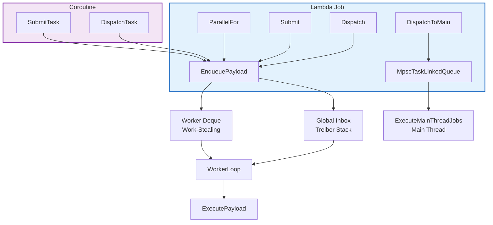
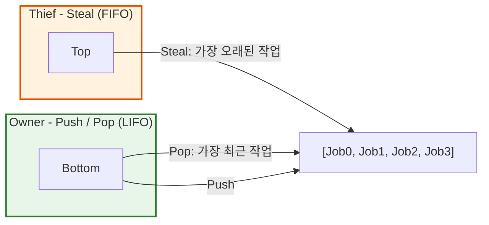

# Job System 아키텍처 - Work-Stealing 기반 병렬 작업 스케줄러

> **한 줄 요약:** 단일 Mutex 기반의 기존 ThreadPool을 폐기하고, Chase-Lev Work-Stealing 알고리즘과 MPSC 큐를 도입하여 락프리(Lock-Free) 기반의 2계층 비동기 스케줄러를 구축했다.

**코드 진입점:**

- `EngineCore/Include/SimpleEngine/Core/Concurrency/JobSystem.h` - 스케줄러 본체 및 Public API
- `EngineCore/Include/SimpleEngine/Core/Concurrency/WorkStealingDeque.h` - Chase-Lev 알고리즘 구현
- `EngineCore/Include/SimpleEngine/Core/Concurrency/MpscTaskLinkedQueue.h` - 메인 스레드 전용 MPSC 큐
- `EngineCore/Include/SimpleEngine/Core/Concurrency/JobPayload.h` - 타입 소거 Job 실행 단위 + SBO
- `EngineCore/Include/SimpleEngine/Core/Concurrency/JobHandle.h` - 완료 추적 핸들 및 JobCounter
- `EngineCore/Include/SimpleEngine/Core/Concurrency/JobAllocator.h` - Lock-Free TLS 기반 풀 할당자

---

## 1. 도입 배경

엔진 초기에는 `std::thread`를 직접 관리하는 **ThreadPool + TaskScheduler** 구조를 사용했다. CPU 집약 작업용 `compute_pool`과 I/O 대기용 `io_pool`을 나누고, `TaskScheduler`가 코루틴 스케줄링을 별도로 담당하는 구조였으나 시스템 규모가 커지면서 다음과 같은 한계가 드러났다.

1. **단일 글로벌 Mutex 병목:** 작업 큐가 하나뿐인 반면 삽입과 인출 시 모든 워커 스레드가 동일한 `std::mutex`를 사용하게 되어 워커 수가 늘어날수록 경합도 비례해서 증가했다.

2. **태스크 간 의존성 추적 불가:** 기존 `Submit()`은 `std::future<T>`만 반환할 뿐, 작업 간의 선후 관계를 선언할 파라미터가 없었다. 복잡한 작업 그래프를 구성하려면 스레드를 직접 블로킹하거나 외부에서 수동 동기화를 처리해야 했다.

3. **코루틴 프레임의 힙 할당 문제:** 기존 구조는 코루틴 생성 시마다 `operator new`로 힙 할당을 수행했다. `Promise.h`에 전용 할당자 오버라이드가 주석으로만 방치되어 있었는데, 대량의 비동기 작업을 다룰 때 발생할 힙 할당자 경합과 메모리 파편화 문제를 안고 있었다.

이러한 문제들을 겪으며 기존 `ThreadPool` 아키텍처의 경직성과 확장성 부족에 큰 불만을 느꼈다. 솔직히 말해, 도입을 결정할 당시에는 "False Sharing"이나 "캐시 지역성" 같은 로우레벨 동시성 프로그래밍에 대한 깊은 지식이 없는 상태였다.

하지만, "이왕 고칠 거, 상용 엔진이 쓰는 진짜 병렬 처리 기법(Work-Stealing)을 밑바닥부터 부딪혀가며 배워보자."는 마음으로, 기존 스케줄러를 전면 폐기하고 Work-Stealing 기반의 Job System으로 완전히 재구축하기로 결정했다.

---

## 2. JobSystem의 아키텍처

Job System은 Lambda 기반의 기본 작업(Layer 1)과 C++20 Coroutine 작업(Layer 2)을 모두 처리하는 2계층 구조로 설계했다.



워커 스레드는 우선순위별로 독립된 `WorkStealingDeque`를 가지며, 비워커 스레드(메인 스레드, 외부 스레드)에서 제출된 Job은 Lock-Free Treiber Stack(Global Inbox)을 경유해 안전하게 전달된다.

---

## 3. 핵심 자료구조

### 3.1. WorkStealingDeque (Chase-Lev)

> `EngineCore/Include/SimpleEngine/Core/Concurrency/WorkStealingDeque.h`

Chase-Lev(2005) 논문을 기반으로 구현한 Lock-Free 양방향 큐다. Owner 스레드는 바닥(Bottom)에서 작업을 넣고(Push) 꺼내며(Pop), Thief 스레드는 위(Top)에서 훔쳐간다(Steal).



- **동작 영역 분리:** Owner가 LIFO 방식으로 최신 작업을 처리해 CPU 캐시 지역성을 극대화하는 동안, Thief는 FIFO 방식으로 가장 오래된 작업을 훔쳐가므로 두 역할 간의 경합이 자연스럽게 분산된다.

- **메모리 배리어 최적화:** Pop과 Steal이 마지막 남은 단일 항목을 두고 경쟁할 때 Store-Load 재정렬로 인한 오작동을 차단하기 위해 강한 메모리 배리어(`seq_cst` fence)를 삽입했다. 단, 불필요한 비용을 줄이기 위해 Lê et al.(2013)의 메모리 모델 최적화 설계를 반영했다.

- **비트마스크 연산:** 내부 원형 버퍼의 크기를 항상 2의 거듭제곱으로 유지하여, 인덱스 래핑 시 무거운 모듈러(`%`) 연산 대신 `& (capacity - 1)` 비트 연산을 적용해 처리 비용을 최소화했다.

| 연산 | 가능한 스레드 | 방향 | 경합 방식 |
| --- | --- | --- | --- |
| **Push** | Owner 전용 | Bottom | 경합 없음 |
| **Pop** | Owner 전용 | Bottom (LIFO) | Steal과 마지막 항목 CAS 경합 |
| **Steal** | Thief 가능 | Top (FIFO) | 다른 Thief와 CAS 경합 |

### 3.2. MpscTaskLinkedQueue (Vyukov MPSC)

> `EngineCore/Include/SimpleEngine/Core/Concurrency/MpscTaskLinkedQueue.h`

메인 스레드 전용 큐로, Dmitry Vyukov의 Non-intrusive Lock-Free MPSC 알고리즘을 구현했다. 다수의 워커 스레드가 경합 없이 노드를 `Push`할 수 있으며, 메인 스레드는 매 프레임 시작 시 `Drain()`을 호출해 가벼운 포인터 추적만으로 작업을 복구 및 실행한다.

---

## 4. 실행 단위 및 메모리 관리

### 4.1. JobPayload (타입 소거 및 SBO)

> `EngineCore/Include/SimpleEngine/Core/Concurrency/JobPayload.h`

`JobPayload`는 사용자가 제출한 람다/함수 객체를 타입 정보 없이 저장하고 실행하는 타입 소거 구조체다. 동적 할당 부하를 최소화하기 위해 **48바이트 인라인 SBO(Small Buffer Optimization)** 를 적용했다.

```cpp
// 람다 크기가 48바이트 이하면 힙 할당 없이 payload 내부 버퍼에 직접 저장
JobPayload* payload = JobPayload::Create([x, y, z]
{
    DoWork(x, y, z); // 캡처 변수 3개: 포인터 3개 = 24바이트 -> Inline 경로
});
```

| 저장 방식 | 조건 | 할당 경로 |
| --- | --- | --- |
| `Inline` | `sizeof(Fn) <= 48B` & `alignof <= 16B` | 추가 할당 없이 구조체 내부 버퍼에 직접 저장 |
| `Pooled` | 48B 초과 & `alignof <= 16B` | `JobAllocator` 전용 풀에서 블록 할당 |
| `Heap` | `alignof > 16B` | OS 직접 할당 (Fallback) |

### 4.2. JobAllocator (Lock-Free TLS 풀)

> `EngineCore/Include/SimpleEngine/Core/Concurrency/JobAllocator.h`

`JobPayload`와 코루틴 프레임(`JobTaskPromise`)의 빈번한 생성 및 소멸 부하를 전담하기 위해 4개의 Size Class(64/128/256/512 바이트) 버킷을 유지하는 풀 할당자다.
할당 요청 시 `TLS 캐시` -> `Global Pool` -> `OS` 순으로 처리하여 대부분의 할당이 스레드 로컬 영역 내에서 무경합으로 완료되도록 최적화했다.

---

## 5. JobCounter & JobHandle (의존성 추적 시스템)

> `EngineCore/Include/SimpleEngine/Core/Concurrency/JobHandle.h`

작업 간의 선후 관계 제어는 Atomic 카운터 기반의 `JobCounter`와 외부 노출 래퍼인 `JobHandle`을 통해 처리된다.

```text
Job 완료
  └─ ExecutePayload()
       └─ counter->Decrement()
            └─ count가 0 도달 시 NotifyWaiters()
                 ├─ 코루틴 Waiter: coroutine_handle.resume() -> JobSystem Deque로 재스케줄링
                 └─ 콜백 Waiter: callback() 직접 호출 (의존성 체인 연결용)
```

### Guard Count 패턴

`Submit(work, dependencies)`을 통해 여러 선행 작업에 완료 콜백을 순차적으로 등록하는 도중, 먼저 등록한 작업이 너무 빠르게 끝나 후행 Payload가 비정상적으로 조기 실행되는 경쟁 상태를 방지해야 했다.

이를 해결하기 위해 실제 의존성 개수에 가드 카운트 1을 더한 `dep_count + 1`로 카운터를 초기화한 후 콜백들을 등록한다. 모든 등록 절차가 완전히 종료된 시점에 가드 카운트를 1만큼 차감(`fetch_sub`)하여 안전하게 타겟 Deque에 진입하도록 제어했다.

---

## 6. 스케줄러 내부 동작

### EnqueuePayload (큐 선택 및 삽입)

`EnqueuePayload()`는 호출 스레드의 컨텍스트를 확인하여 삽입 대상을 결정한다. 워커 스레드에서 호출하면 해당 워커의 우선순위별 `WorkStealingDeque`에 직접 Push하고, 비워커 스레드(메인 스레드, 외부 스레드)에서 호출하면 Global Inbox(Treiber Stack)에 CAS 방식으로 원자적 Push를 수행한다.

```cpp
// 워커 스레드: 자신의 Deque에 직접 Push
worker_states[my_worker_index].deques[priority].Push(payload);

// 비워커 스레드: Global Inbox(Treiber Stack)에 CAS Push
JobPayload* old_head = global_inbox.load(std::memory_order_relaxed);
do { payload->next_pending = old_head; }
while (!global_inbox.compare_exchange_weak(old_head, payload));
```

### WorkerLoop (워커 메인 루프)

각 워커는 아래 순서로 작업을 탐색하며, 모든 탐색이 실패하면 `pending_jobs == 0`을 sleep predicate로 삼아 `condition_variable`에서 대기한다.

1. `TryPopLocal()`: 자신의 로컬 Deque 확인 (우선순위 역순)
2. `TryPopGlobal()`: Global Inbox의 작업을 자신의 로컬 Deque로 일괄 인출 및 이동
3. `TryStealFromOthers()`: 타 워커 스레드의 Deque에서 작업 Steal 시도
4. 모든 탐색이 실패하면 `condition_variable` 대기 상태(Sleep)로 전환

---

## 7. Public API

```cpp
// 1. Dispatch: 완료 추적 없이 즉시 제출 (Fire-and-Forget)
JobSystem::Get().Dispatch([]{ DoWork(); });

// 2. Submit: 완료 핸들 반환
JobHandle h = JobSystem::Get().Submit([]{ DoWork(); });
h.Wait(); // 블로킹 대기

// 3. Submit with dependencies: 의존성 완료 후 실행
JobHandle a = JobSystem::Get().Submit([]{ StageA(); });
JobHandle b = JobSystem::Get().Submit([]{ StageB(); });
JobHandle c = JobSystem::Get().Submit([]{ StageC(); }, { a, b });

// 4. ParallelFor: 범위를 배치로 분할하여 병렬 실행
// count=1000, batch=50 -> 20개의 Job이 동시에 워커에 분산됨
JobHandle h = JobSystem::Get().ParallelFor(1000, 50, [](usize i)
{
    ProcessItem(i);
});
h.Wait();

// 5. DispatchToMain: 메인 스레드에서 실행
JobSystem::Get().DispatchToMain([]{ UpdateUI(); });
```

| API | 완료 추적 | 의존성 설정 | 사용 목적 |
| --- | :---: | :---: | --- |
| `Dispatch` | X | X | Fire-and-Forget |
| `Submit` | O | O | 완료 동기화, 의존성 체인 |
| `ParallelFor` | O | X | 데이터 병렬 처리 |
| `DispatchToMain` | X | X | 메인 스레드 위임 |
| `DispatchTask` / `SubmitTask` | X / O | X | 코루틴 제출 (Layer 2) |

---

## 8. 최적화: 유휴 워커 CPU 과소비 개선 ([PR #33](https://github.com/gudtldn/SimpleEngine/pull/33))

초기 구현에서는 큐가 비어있는 유휴 상태에서도 워커 스레드들이 스케줄링 탐색을 위해 무의미하게 높은 CPU 자원을 소모하는 문제가 발생했다. 프로파일링 결과, 매 스핀마다 모든 워커의 Deque를 순회하며 훔칠 작업을 찾는 `TryStealFromOthers`의 잦은 CAS 경합과, 수면 조건 검사(`wait_for`) 오버헤드가 주요 원인이었다.

**해결: `pending_jobs` 힌트 카운터 및 스핀 로직 최적화**

1. **단일 카운터 조건 검사 (`pending_jobs`):** `EnqueuePayload` 시 증가하고 `ExecutePayload` 시 감소하는 원자적 힌트 카운터를 도입했다. 수면 진입 조건 검사 시 모든 Deque를 무조건 순회(O(N))하는 대신, 카운터 단일 조회(O(1))로 변경하여 오버헤드를 낮췄다.
2. **Steal 횟수 제한:** 유휴 스핀을 도는 내내 타 워커의 큐를 훔치려 시도하여 CAS 경합을 유발하던 문제를 개선해, 유휴 상태로 전환된 직후(`idle_spins == 0`) 단 1회만 `TryStealFromOthers`를 호출하도록 제한했다.
3. **스핀 -> yield -> 수면 단계적 백오프:** 무의미한 스핀 대기 및 `yield()` 호출 횟수를 대폭 줄여 불필요한 스케줄러 양보를 막고 즉시 수면(`wait_for`)에 돌입하도록 수정했다. 또한 `wait_for`에서 `pending_jobs > 0` 조건 검사로 Spurious Wake 시에도 불필요한 재탐색을 방지했다.
4. **Global Inbox Fast-path:** `TryPopGlobal`에서 inbox가 비어있을 경우 무거운 `atomic::exchange` 연산을 건너뛰는 Fast-path를 추가했다.

이 최적화를 통해 작업이 없는 상태에서의 유휴 CPU 점유율을 크게 낮췄다.

---

## 9. 한계 및 미래 과제

- **우선순위 역전(Priority Inversion) 미처리:** 현재 우선순위 설계는 각 워커가 자신의 Critical -> Normal -> Low 순으로 Deque를 탐색하는 방식이다. 낮은 우선순위 작업이 높은 우선순위 작업의 의존성을 보유하더라도 이를 감지하여 승격시키는 메커니즘은 구현되어 있지 않다.
- **Tracy 프로파일링 연동:** `tracy/Tracy.hpp`가 이미 포함되어 있고 `wake_mutex`에 `TracyLockable`이 적용된 상태이나, Job 단위의 세밀한 타임라인 마킹은 아직 추가되지 않았다.

---

## 참고

- [Chase-Lev Deque 원논문 (2005)](https://www.dre.vanderbilt.edu/~schmidt/PDF/work-stealing-dequeue.pdf)
- [Weak Memory Model 최적화 (Lê et al., 2013)](https://inria.hal.science/hal-00802885/document)
- [Vyukov MPSC Queue](https://web.archive.org/web/20210124182030/http://www.1024cores.net/home/lock-free-algorithms/queues/non-intrusive-mpsc-node-based-queue)
- [Coroutine-Integration.md - C++20 코루틴 통합 상세](./Coroutine-Integration.md)
