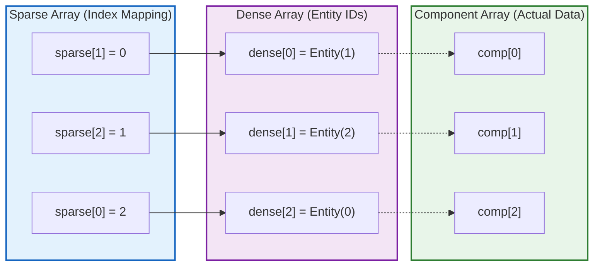

# ECS 내부 구조 - 메모리 레이아웃과 데이터 흐름 제어

> **한 줄 요약:** Entity는 세대(Generation)가 포함된 핸들로 관리되며, 컴포넌트는 타입별 Sparse Set에 밀집 저장되고, System은 의존성 자동 주입을 통해 실행된다.

**코드 진입점:**

- `EngineCore/Include/SimpleEngine/ECS/Entity.h` - Generational Handle 구조
- `EngineCore/Include/SimpleEngine/ECS/SparseSet.h` - 컴포넌트 저장 자료구조
- `EngineCore/Include/SimpleEngine/ECS/Schedule.h` - System 등록 및 실행
- `EngineCore/Include/SimpleEngine/ECS/CommandBuffer.h` - 지연 실행 버퍼
- `EngineCore/Include/SimpleEngine/ECS/ECSRegistry.h` - 타입 소거 기반 싱글톤 레지스트리

---

## 1. Entity (Generational Handle)

Entity는 슬롯 인덱스(`id`)와 재사용 횟수(`generation`)를 결합한 **Generational Handle(세대 핸들)** 구조로 설계했다.

```cpp
class Entity
{
    u32 id;         // 슬롯 인덱스
    u32 generation; // 재사용 횟수 (버전)
};
```

단순 ID만 저장할 경우, 엔티티가 소멸된 후 해당 슬롯에 새로운 엔티티가 할당되었을 때 이전 핸들을 들고 있는 시스템이 잘못된 메모리에 접근하는 **댕글링(Dangling) 문제**가 발생한다. `generation`을 추가하여 핸들의 생명주기를 엄격하게 비교함으로써, 삭제된 슬롯이 재사용되더라도 과거의 유효하지 않은 접근을 완벽하게 차단하도록 했다.

---

## 2. Component Storage (Sparse Set)

엔티티에 부착되는 데이터(Component)는 타입별로 `SparseSet<T>`에 저장된다. 내부 구조는 희소 배열(`sparse`), 밀집 배열(`dense`), 그리고 실제 컴포넌트 데이터 배열(`components`) 3가지로 구성된다.



**주요 연산 복잡도:**

| 연산 | 복잡도 | 메커니즘 |
| --- | :---: | --- |
| **Add** | O(1) | `sparse`에 인덱스 기록 후 `dense`와 `components` 맨 뒤에 Push |
| **Remove** | O(1) | **Swap-and-pop** 방식을 적용하여 O(1) 삭제 보장 |
| **Contains** | O(1) | `sparse` 인덱스 조회 및 엔티티 `generation` 검증 |
| **Iteration** | O(N) | 압축된 밀집 배열을 연속 순회하여 캐시 효율 극대화 |

**연속성 보장 (Swap-and-pop):** 엔티티 삭제 시 배열 중간에 구멍이 뚫리면 캐시 친화적인 연속 순회가 불가능해진다. 이를 방지하고자 삭제된 빈자리를 배열 맨 끝 데이터로 즉시 메워 메모리 파편화를 원천 차단했다.

---

## 3. World와 전역 Resource

`World`는 ECS의 중심 컨테이너로, 타입별 `SparseSet`을 `HashMap<TypeId, IComponentStorage>` 형태로 관리한다. 모든 스토리지는 `IComponentStorage` 인터페이스로 추상화되어 타입 정보 없이도 제어할 수 있다.

엔티티에 귀속되지 않는 게임 시간, 입력 상태 등 씬(Scene) 전역의 싱글톤 데이터는 **Resource**로 취급하여 World 내부에 단일 인스턴스로 관리된다.

```cpp
// System 함수에서 Resource 접근
void TimeSystem(Resource<GameTime> time, Query<Position&, const Velocity&> query)
{
    float dt = time->delta_seconds;
    for (auto [pos, vel] : query)
    {
        pos.x += vel.x * dt;
    }
}
```

---

## 4. System (자동 의존성 주입)

System은 엔진의 로직을 담당하는 일반 함수 또는 람다 객체다. `Schedule`에 System을 등록하면, `BindCallable()` 템플릿 메타 함수가 매개변수의 함수 시그니처를 분석하여 실행 시점에 필요한 `Query`, `Commands`, `Resource`를 자동으로 주입(Dependency Injection)한다.

```cpp
// 1. System 정의: 사용자는 필요한 매개변수 타입만 선언한다.
void MovementSystem(Query<Position&, const Velocity&> query)
{
    for (auto [pos, vel] : query) { pos.x += vel.x; }
}

// 2. Schedule 등록: 매개변수에 맞춰 World 데이터를 자동 바인딩한다.
schedule.Add(MovementSystem)
        .Add(RenderSystem);

// 3-1. 실행 조건 제어 (RunIf)
System(MovementSystem)
    .RunIf([](Resource<const GameState&> state) { return state->is_playing; });

// 3-2. 각각의 System을 하나로 묶어 그룹화
SystemChain(MovementSystem, RenderSystem)
    .RunIf([](Resource<const GameState&> state) { return state->is_playing; });
```

---

## 5. Stage와 Phase - 실행 스케줄 구조

`Schedule`은 System 목록을 순서대로 실행하는 실행기이고, `ScheduleStage`는 Phase 라벨, Schedule, 실행 모드(Mode)를 하나로 묶은 단위다. 하나의 `WorldContext`가 여러 `ScheduleStage`를 순서대로 실행하며, 각 Stage의 Mode에 따라 실행 횟수가 결정된다.

| 모드 | 동작 |
| --- | --- |
| `Once` | 해당 프레임에 한 번 실행되며, 프레임 내 모든 Stage가 완료된 후 일괄 제거 (씬 초기화 등) |
| `EveryFrame` | 매 프레임 실행 |
| `FixedTimestep` | 누적된 고정 시간만큼 반복 실행 (물리 시뮬레이션) |

엔진은 기본적으로 5개의 Phase를 순서대로 실행한다.

| 순서 | Phase | Mode | 용도 |
| --- | :---: | --- | --- |
| 1 | `StartupPhase` | Once | 초기 리소스 로드, 씬 구성 |
| 2 | `PreUpdatePhase` | EveryFrame | 입력 처리, 이벤트 수집 |
| 3 | `FixedUpdatePhase` | FixedTimestep | 물리 시뮬레이션 |
| 4 | `UpdatePhase` | EveryFrame | 게임 로직 |
| 5 | `PostUpdatePhase` | EveryFrame | 렌더링 준비, 정리 |

커스텀 Phase는 기존 Phase를 기준으로 삽입할 수 있다.

```cpp
ctx.AddStageAfter<UpdatePhase, MyCustomPhase>(EScheduleMode::EveryFrame);
ctx.AddStageBefore<PostUpdatePhase, LateUpdatePhase>(EScheduleMode::EveryFrame);
```

---

## 6. Command Buffer (지연 실행)

System 실행 도중(순회 중)에 엔티티를 생성/삭제하거나 컴포넌트를 부착/제거하면 현재 순회 중인 Sparse Set 배열의 구조가 변경되어 이터레이터 무효화(Iterator Invalidation)가 발생한다.

이를 방지하기 위해 구조적 변경 명령은 즉시 처리되지 않고 `CommandBuffer`에 큐잉된다. 이후 System 단위 실행이 종료되면 `Schedule`이 자동으로 `Flush()`를 호출하여 변경 사항을 안전하게 일괄 적용한다.

```cpp
void SpawnSystem(Query<const SpawnRequest&> requests, Commands commands)
{
    for (auto [request] : requests)
    {
        // 즉시 실행되지 않고 CommandBuffer 큐에 적재됨
        commands.SpawnEntity()
                .Insert(Position{ request.x, request.y })
                .Insert(Velocity{});
    }
    // System 종료 시 엔진 루프에서 자동으로 Flush() 호출
}
```

---

## 7. ECSRegistry (타입 소거 기반 런타임 제어)

에디터의 인스펙터(Inspector)나 리플렉션 시스템은 런타임에 컴파일 타임 타입 정보(`T`) 없이 컴포넌트를 조작해야 한다. `ECSRegistry`는 이를 위해 각 타입의 제어 함수(Add, Remove, Get 등)를 람다로 캡처하여 `ComponentOps` 구조체로 저장하는 싱글톤 레지스트리이다.

엔진 초기화 시 컴포넌트의 제어 연산을 등록해 두면, 에디터는 `void*` 수준에서 데이터를 동적으로 읽고 쓸 수 있다.

```cpp
// 엔진 초기화 시 타입별 제어 연산 등록
ECSRegistry::Get().RegisterComponentOps<TransformComponent>();
ECSRegistry::Get().RegisterComponentOps<MeshMaterialComponent>();

// 에디터 런타임 접근 (타입 정보 T 불필요)
if (auto ops = ECSRegistry::Get().GetComponentOps(type_id))
{
    void* data = ops->get_component_mutable(world, selected_entity);
    // Reflection Data를 활용하여 필드 편집 수행
}
```

---

## 8. 한계 및 미래 과제

- **Archetype 미구현:** 현재 설계된 Sparse Set 방식은 특정 엔티티 집합이 여러 개의 컴포넌트를 동시에 가질 때(예: Position과 Velocity), 각 컴포넌트의 풀을 별개로 조회해야 한다. 이를 극복하기 위해 동일 컴포넌트 조합을 하나의 블록으로 묶는 Archetype(Flecs 방식) 구조의 도입이 필요하다.
- **멀티스레드 System 실행 부재:** 현재 Schedule은 시스템들을 단일 스레드에서 순차적으로 처리한다. System 매개변수(`Query`)의 읽기/쓰기 권한을 분석하여 데이터 의존성이 없는 시스템들을 추출, Job System의 Task Graph와 연동하여 병렬 실행하는 고도화가 요구된다.
- **`Query` 개선:** 현재 `Query`는 컴파일 타임에 모든 타입을 알 수 있음에도 불구하고, 가상함수 오버헤드가 있는 `IComponentStorage` 인터페이스를 통해서 관리하고 있다. `std::tuple`을 기반으로 컴파일 타임에 완전히 전개되는 `Query` 구현으로 변경할 예정이다.

---

## 참고

- `04_ECS/ECS-Philosophy.md` - ECS 도입 배경
- `04_ECS/ECS-Query.md` - TMP 기반 Query 시스템 상세
