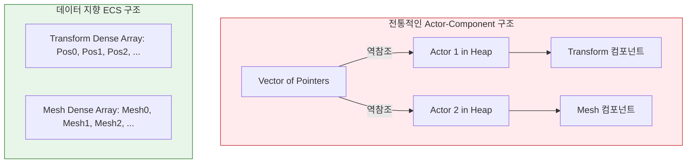

# ECS 도입 배경 - OOP의 한계와 새로운 패러다임 도전

> **한 줄 요약:** 테크랩에서 상속 기반의 Actor-Component 엔진을 경험한 후, 과거 Bevy 엔진으로 접했던 ECS 패러다임을 밑바닥부터 깊이 있게 학습하고 구현하기 위해 도입했다.

**코드 진입점:**

- `EngineCore/Include/SimpleEngine/ECS/ECSRegistry.h` - 타입 소거 기반 컴포넌트 연산 레지스트리(에디터/리플렉션용)
- `EngineCore/Include/SimpleEngine/ECS/SparseSet.h` - 컴포넌트 저장소 핵심 자료구조
- `EngineCore/Include/SimpleEngine/ECS/Query.h` - 컴포넌트 쿼리 인터페이스

---

## 1. 이전 엔진의 경험과 한계

### 1.1. 테크랩 자체엔진의 구조 (Actor-Component)

테크랩에서 개발한 [DX11 기반 자체엔진](https://github.com/Jungle-TechLab/GTL_W12_T1)은 Unreal Engine의 아키텍처를 참고하여 **Actor-Component 구조**로 설계되었다. `AActor`가 중심이 되어 여러 `UComponent`를 소유하고, 전체 씬은 이 Actor 포인터들의 배열(`TArray<AActor*>`)로 관리하는 전형적인 OOP(객체 지향) 방식이었다.

### 1.2. 상속 계층 비대화와 복잡도

프로젝트 규모가 커지고 기능이 추가될수록 `AActor -> APawn -> ACharacter` 형태로 상속 계층이 점차 깊어졌다. 이로 인해 상위 계층의 사소한 변경이 하위 계층에 예기치 못한 사이드 이펙트를 일으키는 현상이 반복되었고, 기능이 여러 클래스에 분산되어 코드 흐름을 추적하는 비용도 증가했다.

---

## 2. ECS를 선택한 이유

### 2.1. 패러다임의 전환과 학습 목적

과거 Rust의 **Bevy 엔진**을 활용해 간단한 게임을 개발하면서 ECS(Entity Component System) 패러다임을 처음 접했었다. 데이터와 로직이 철저히 분리되는 구조에 흥미를 느꼈고, 테크랩에서 상속 기반의 OOP 엔진을 완전히 끝까지 완성해 본 시점에서 다음 도전 과제로 ECS 아키텍처를 선택했다. 게임 엔진을 구성하는 두 가지 거대한 패러다임을 모두 밑바닥부터 구현해 보며 아키텍처적 시야를 넓히는 것이 가장 큰 목적이었다.

### 2.2. 메모리 및 구조적 배치 차이



- **OOP (상속/소유):** 데이터가 객체별로 힙에 흩어져 포인터로 연결됨.
- **ECS (분리/밀집):** 엔티티는 단순 정수 ID일 뿐이며, 컴포넌트 데이터는 타입별로 메모리상에 **연속된 배열**로 관리됨.

---

## 3. SimpleEngine의 설계 방향

`SimpleEngine`은 구상 단계부터 "게임 로직은 ECS 중심으로 처리한다"는 명확한 방향성을 세우고 시작했다. 시스템을 직접 설계하면서 업계에서 검증된 두 가지 레퍼런스를 벤치마킹했다.

- **자료구조 (EnTT):** 고성능 C++ ECS의 표준으로 자리 잡은 **EnTT**의 Sparse Set 구조를 분석하여 컴포넌트 저장소의 기반을 다졌다.
- **API 디자인 (Bevy):** 과거 사용해 보았던 Bevy 엔진의 직관적인 Query 스타일을 참고했다. 타입 선언만으로 타겟 컴포넌트들을 필터링하고 읽기/쓰기 권한을 명시하는 인터페이스를 모던 C++ 환경에 맞게 이식하는 것을 목표로 삼았다.

```cpp
// SimpleEngine의 ECS 기반 시스템 순회 예시
// 특정 컴포넌트 조합만 연속 메모리 공간에서 순회하므로 구조적으로 캐시 효율적임
void MySystem(Query<Position&, const Velocity&> query)
{
    for (auto [position, velocity] : query)
    {
        position.x += velocity.x * delta_time;
    }
}

world_context.AddSystem<UpdatePhase>(MySystem);
```

---

## 4. 구조적 특징 및 트레이드오프

ECS 아키텍처를 직접 구현하고 적용하면서 아래와 같은 특성들을 파악할 수 있었다.

**구조적 이점:**

- **유연한 기능 조합 (Composition):** 깊은 상속 계층 없이 컴포넌트 부착만으로 객체의 속성을 자유롭게 정의할 수 있다.
- **로직과 데이터의 분리:** 로직이 System 단위로 분절되어 있어 데이터 의존성이 명확해지고 모듈화가 용이하다.
- **DOD 자원 배치:** 데이터를 연속 배열에 배치하는 아키텍처를 구축함에 따라, 대량의 데이터를 순회할 때 메모리 캐시 지역성을 자연스럽게 확보하게 된다.

**수용한 비용 및 과제:**

- 단일 객체 중심의 직관적인 상태 관리가 필요한 로직에서는 OOP 방식보다 설계가 번거로울 수 있다.
- 현재 구현된 Sparse Set 기반 구조는 동일한 컴포넌트 조합을 가진 엔티티만 골라 순회할 때 Archetype 방식에 비해 미세한 오버헤드가 존재하며, 이는 추후 고도화 과제로 남겨두었다.

---

## 참고

- [EnTT GitHub](https://github.com/skypjack/entt)
- [Bevy ECS](https://bevyengine.org/learn/book/getting-started/ecs/)
- [04_ECS/ECS-Architecture.md](./ECS-Architecture.md) - SparseSet 내부 구조
- [04_ECS/ECS-Query.md](./ECS-Query.md) - TMP 기반 Query 시스템 상세
