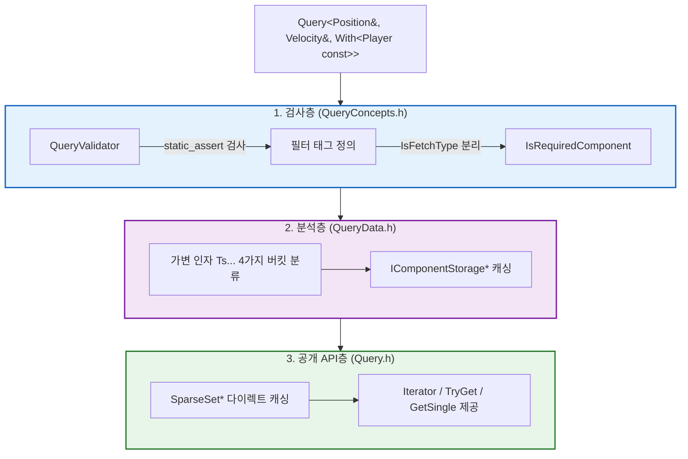

# ECS Query 시스템 - TMP와 Concepts 기반 타입 안전 순회

> **한 줄 요약:** `Query<Ts...>` 하나로 컴포넌트 조합, 읽기/쓰기 권한, 필터 조건을 컴파일 타임에 검증하고, `index_sequence` 기반 언팩킹을 통해 런타임 오버헤드 없이 데이터를 추출한다.

**코드 진입점:**

- `EngineCore/Include/SimpleEngine/ECS/QueryConcepts.h` - 컴파일 타임 유효성 검사 및 필터 태그
- `EngineCore/Include/SimpleEngine/ECS/QueryData.h` - 풀 캐싱 및 월드 타입 추론
- `EngineCore/Include/SimpleEngine/ECS/Query.h` - Query 본체 API
- `EngineCore/Include/SimpleEngine/ECS/SystemBinding.h` - System 함수에 Query 자동 주입

---

## 1. 아키텍처 파이프라인 (3계층 분리)

Query 시스템은 역할에 따라 3개의 계층(파일)으로 분리되어 작동한다.



**Ts... 타입 분류 기준:**
각 파라미터는 `QueryData`에 의해 형태에 따라 하나 이상의 논리적 버킷으로 분류된다.

| 파라미터 형태 | FetchTypes | PredicateTypes | WithTypes | WithoutTypes |
| --- | :---: | :---: | :---: | :---: |
| `Position&` | O | O | | |
| `const Velocity&` | O | O | | |
| `Optional<Mesh&>` | O | | | |
| `Entity` | O | | | |
| `With<Player>` | | O | O | |
| `Without<Dead>` | | | | O |

> **참고:** `PredicateTypes`는 FetchTypes에서 Optional과 Entity를 제외하고 WithTypes를 포함한 집합이다. "이 Entity가 쿼리에 부합하는가?"를 판정하는 핵심 기준 타입들만 포함한다.

---

## 2. API 설계 (Bevy 스타일)

> `EngineCore/Include/SimpleEngine/ECS/Query.h`

Query의 API는 Rust의 Bevy Engine에서 영감을 받아 설계되었다. 타입 파라미터 선언만으로 읽기/쓰기 권한과 필터 조건을 직관적으로 표현한다.

```cpp
// T& -> 쓰기 가능
// const T& 또는 T -> 읽기 전용
// Optional<T&> -> 선택적 컴포넌트
// With<T>, Without<T> -> 필터 태그 (결과에 포함되지 않음)
// Entity -> 엔티티 ID 자체

// 기본 사용: Position 쓰기, Velocity 읽기 권한
void MovementSystem(Query<Position&, const Velocity&, Entity> query)
{
    for (auto [pos, vel, entity] : query)
    {
        pos.x += vel.x;
    }
}

// 필터 태그: Player 컴포넌트가 있고 Dead 컴포넌트가 없는 엔티티만 필터링
void PlayerSystem(Query<Health&, With<Player>, Without<Dead>> query) { ... }

// 선택적 컴포넌트
void RenderSystem(Query<const Transform&, Optional<const Mesh&>> query) { ... }
```

---

## 3. 컴파일 타임 유효성 검사

> `EngineCore/Include/SimpleEngine/ECS/QueryConcepts.h`(`QueryValidator`, `With`, `Without`)

잘못된 Query 사용은 런타임 오버헤드나 크래시로 이어지지 않고 **컴파일 시점에 완벽히 차단**된다. `QueryValidator`가 7가지 조건을 `static_assert`로 검사한다.

| 검사 항목 | 위반 예시 | 에러 메시지 (컴파일 타임) |
| --- | --- | --- |
| 최소 1개 이상 파라미터 | `Query<>` | "Query requires at least one component or filter tag." |
| 타입 중복 불가 | `Query<Pos, Pos>` | "Query parameters must be unique." |
| 포인터 불가 | `Query<Pos*>` | "Raw pointers are not permitted in Query." |
| 기본 타입 불가 | `Query<int>` | "Query parameters must be valid component types." |
| Entity 값 타입 강제 | `Query<Entity&>` | "Entity in a Query must be fetched by value." |
| `Optional` 참조 불가 | `Query<Optional<T>&>` | "Optional\<T\> must not have an outer reference." |
| `Optional<Entity>` 불가 | `Query<Optional<Entity>>` | "Optional\<Entity\> is not allowed in a Query." |

---

## 4. 읽기/쓰기 권한 추론 (`IsReadOnlyType`)

> `EngineCore/Include/SimpleEngine/ECS/QueryConcepts.h`(`IsReadOnlyType`)
> `EngineCore/Include/SimpleEngine/ECS/Query.h`(`PoolPtrType`, `TargetWorld` 추론)

Query 파라미터의 타입을 분석해 기반이 되는 `SparseSet`에 대한 접근 권한(const / non-const)을 컴파일 타임에 결정한다.

```cpp
template <typename T>
using PoolPtrType = std::conditional_t<
    IsReadOnlyType<T>::Value,
    const SparseSet<InnerOf<T>>*, // 읽기 전용
    SparseSet<InnerOf<T>>*        // 쓰기 가능
>;
```

Query 전체가 읽기 전용으로 구성되면 내부적으로 `TargetWorld`가 `const World`로 추론되어, 불변성이 보장된 환경(const World)에서도 안전하게 사용할 수 있도록 설계했다.

---

## 5. 풀 캐싱과 튜플 언팩킹

> `EngineCore/Include/SimpleEngine/ECS/Query.h`(`FetchPoolsTuple`, `fetch_pools`, `Iterator::operator*`)

매 순회마다 해시맵(HashMap)에서 컴포넌트 풀을 찾는 오버헤드를 제거하기 위해, Query 생성 시 필요한 `SparseSet` 포인터들을 튜플(`FetchPoolsTuple`)로 캐싱한다.

```cpp
// FetchTypes = std::tuple<Position&, const Velocity, Entity>
// FetchPoolsTuple = std::tuple<SparseSet<Position>*, const SparseSet<Velocity>*, EmptyType>

// 생성자에서 풀 캐싱
fetch_pools = traits::ApplyTypes<FetchTypes>([&world]<typename... Ts>
{
    return FetchPoolsTuple{ GetPoolPtr<TargetWorld, Ts>(world)... };
});
```

가장 핵심적인 런타임 최적화는 이터레이터의 `operator*`에서 컴포넌트를 꺼낼 때 발생한다. `std::index_sequence`를 활용하여 튜플을 컴파일 타임에 언팩킹한다.

```cpp
// 해시맵 조회 없이 인덱스를 통해 O(1) 다이렉트 접근
return [this, entity]<usize... Is>(std::index_sequence<Is...>)
{
    return value_type{
        FetchComponent<std::tuple_element_t<Is, FetchTypes>, Is>(entity)...
    };
}(std::make_index_sequence<std::tuple_size_v<FetchTypes>>{});
```

각 인덱스의 풀 포인터(`std::get<Is>(fetch_pools)`)에서 컴포넌트를 즉시 가져오는 과정이 컴파일 타임에 완전히 전개되므로, 런타임 비용 없이 필요한 컴포넌트 조합을 빠르게 추출할 수 있다.

---

## 6. 최소 풀 순회 전략

> `EngineCore/Include/SimpleEngine/ECS/QueryData.h`(`FindSmallestPool`)

다중 컴포넌트를 순회할 때 가장 효율적인 방식은 **가장 원소 수가 적은 풀을 기준으로 순회**하는 것이다.

```cpp
// 실행 시점에 가장 작은 SparseSet을 iteration_source로 결정
if constexpr (IsComponentRestricted)
{
    iteration_source = query_data.FindSmallestPool();
}
```

예를 들어 `Position`(1000개)과 `Velocity`(10개)를 동시에 조회할 때, 가장 작은 풀인 `Velocity`를 순회 기준으로 삼아 단 10번의 `Contains` 검사만 수행하도록 최적화하여 런타임 성능을 극대화했다.

---

## 7. SystemBinding (의존성 자동 주입)

> `EngineCore/Include/SimpleEngine/ECS/SystemBinding.h`(`BindCallable`, `SystemParamExtractor`)

사용자가 정의한 System 함수(또는 람다)는 `BindCallable()`을 통해 `World` 기반의 래퍼(Wrapper)로 변환된다. `FunctionTraits`로 함수의 시그니처를 분석하고 `SystemParamExtractor`를 호출하여 필요한 인자를 자동 구성한다.

```cpp
// SystemParamExtractor의 런타임 인자 구성 로직
return [func](World& world) mutable -> RetType
{
    return traits::ApplyTypes<ArgsTypes>([&world, &func]<typename... Ts>
    {
        return func(SystemParamExtractor<std::remove_cvref_t<Ts>>::Fetch(world)...);
    });
};
```

| 인자 타입 (T) | Extractor 동작 결과 |
| --- | --- |
| `Query<Ts...>` | `Query<Ts...>{ world }` 동적 생성 및 주입 |
| `Commands` | World 내부의 활성 `CommandBuffer` 객체 주입 |
| `Resource<T>` | World에서 관리 중인 싱글톤 인스턴스 주입 |

---

## 참고

- [Bevy ECS Query](https://docs.rs/bevy_ecs/latest/bevy_ecs/system/struct.Query.html)
