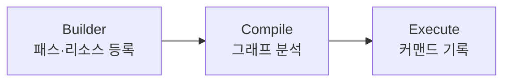

# Render Graph - 렌더링 패스 의존성 및 리소스 수명 자동화

> **한 줄 요약:** 패스 간 리소스 의존성을 선언적으로 기술하고, 실행 순서와 리소스 수명을 자동화하는 렌더링 프레임워크를 구축했다.

**코드 진입점:**

- `EngineCore/Include/SimpleEngine/Graphics/RenderGraph/RenderGraphBuilder.h` - 패스와 리소스 등록
- `EngineCore/Include/SimpleEngine/Graphics/RenderGraph/RenderGraphExecutor.h` - 컴파일 및 실행
- `EngineCore/Include/SimpleEngine/Graphics/RenderPass/RenderPassBase.h` - 패스 인터페이스 (Setup / Execute)
- `EngineCore/Source/Graphics/RenderGraph/RenderGraphExecutor.cpp` - Compile() 전체 구현

---

## 1. 왜 Render Graph (Frame Graph)를 도입했는가

### 1.1. 테크랩 자체엔진 개발에서의 교훈

테크랩에서 [DX11 기반 자체 엔진](https://github.com/Jungle-TechLab/GTL_W12_T1)을 개발할 당시에 즉시 컨텍스트(Immediate Context) 방식의 렌더링 파이프라인을 사용하고 있었는데, 패스가 늘어날수록 메인 루프 내에서 리소스 의존성이 복잡하게 꼬이는 구조적 한계를 가지고 있었다.

### 1.2. 업계 표준 벤치마킹을 통한 문제 해결

이 문제를 근본적으로 해결하기 위해 Unreal Engine의 **RDG(Render Dependency Graph)**와 Frostbite의 **Frame Graph**를 조사했다. "사용자는 의존성만 선언하고, 실제 실행 순서와 자원 관리는 엔진이 결정한다"는 구조에서 파이프라인 관리의 명확한 해답을 찾았고, 이를 `SimpleEngine`에 도입하여 기존의 구조적 한계를 아키텍처 레벨에서 극복하고자 했다.

---

## 2. Render Graph의 핵심 구조 및 작동 원리

Render Graph는 Builder(등록) -> Compile(분석) -> Execute(실행)의 세 단계로 작동한다.



### 2.1 Setup 단계 - 선언적 의존성 기술

각 패스는 `RenderPassBase`를 상속해 `Setup`과 `Execute`를 구현한다. `Setup`에서는 이 패스가 어떤 리소스를 읽고 쓰는지만 선언한다. 실제 GPU 커맨드는 기록할 수 없다.

```cpp
class ForwardScenePass : public RenderPassBase
{
public:
    void Setup(RGSetupContext& context) override
    {
        // "이 패스는 이 리소스에 쓴다"고 선언만 함
        context.Write(color_target_handle);
        context.Write(depth_target_handle);
    }

    void Execute(RGExecutionContext& context) override
    {
        // 가상 핸들 -> 실제 SDL_GPUTexture* 변환
        SDL_GPUTexture* color = context.GetActualTexture(color_target_handle);
        SDL_GPUTexture* depth = context.GetActualTexture(depth_target_handle);
        // SDL_GPU 커맨드 기록...
    }
};
```

패스를 그래프에 등록하는 것도 간단하다.

```cpp
// RenderGraphBuilder 사용 예시
builder.ImportTexture("Swapchain", swapchain_texture);   // 외부 리소스 등록
auto depth = builder.CreateTexture("Depth", depth_desc); // 임시 리소스 선언

auto& forward = builder.AddPass<ForwardScenePass>(draw_data, color_handle, depth);
```

### 2.2 Compile 단계 - 그래프 구축 및 분석

`RenderGraphExecutor::Compile()`은 Execute 직전에 호출되며 5단계로 구성된다.

| 단계  | 이름            | 내용                                                                      |
| :-: | ------------- | ----------------------------------------------------------------------- |
|  1  | SSA 기반 자동 버저닝 | Write마다 리소스 버전 증가 -> DAG 구성. WAW(Write-After-Write도 암묵적 Read로 처리해 순서 보장 |
|  2  | Pass Culling  | 역방향 BFS로 최종 출력에 기여하지 않는 패스 제거                                           |
|  3  | 위상 정렬         | Kahn's algorithm(O(N+E))으로 실행 순서 확정. 순환 의존성 감지 시 Fatal Assert           |
|  4  | 수명 분석         | 각 리소스의 first/last use 패스 계산                                             |
|  5  | 스케줄 구축        | 패스 경계마다 Realize/Unrealize 시점 결정                                         |

### 2.3 Execute 단계 - 커맨드 기록

컴파일 결과에 따라 패스를 순서대로 실행한다. 각 패스 직전에 해당 패스에서 처음 필요한 리소스를 `FrameResourcePool`에서 꺼내고(`Realize`), 패스가 끝나면 더 이상 필요 없는 리소스를 즉시 반납한다(`Unrealize`).

### 2.4 리소스 배리어 처리

SDL3GPU는 리소스 배리어를 완전 자동으로 관리한다. Vulkan이나 D3D12처럼 배리어를 직접 삽입하는 API 자체가 없다. RenderGraph의 Read/Write 선언은 배리어가 아닌 실행 순서와 리소스 수명 분석을 위한 것이다. `ForwardScenePass`든 `DebugLinePass`든 패스 작성자는 동기화를 신경 쓸 필요가 없다.

### 2.5 임시 리소스 풀링 - FrameResourcePool

`CreateTexture`로 선언한 임시 리소스는 즉시 GPU 메모리를 할당하지 않는다. Compile 단계에서 결정된 시점에 `FrameResourcePool`에서 꺼내 사용하고, 마지막 사용 패스가 끝나면 즉시 반납한다.

반납된 리소스는 소멸되지 않고 풀에 대기 상태로 유지된다. 다음 프레임에 동일한 스펙의 리소스가 필요하면 새로 할당하지 않고 재사용한다. 일정 프레임(`MAX_IDLE_FRAMES = 3`) 동안 미사용 상태가 지속된 리소스는 `Trim()`으로 실제 해제한다.

---

## 3. 도입 후 달라진 것

Render Graph 도입 후 렌더링 코드 작업 방식이 바뀌었다.

1. **구조적 안정성:** 패스 순서를 바꾸거나 새 패스를 추가해도 기존 패스를 수정할 필요가 없다. 의존성은 그래프가 다시 계산한다.

2. **메모리 효율:** 임시 텍스처의 수명이 자동으로 최소화된다. 동일 스펙의 임시 리소스는 수명이 겹치지 않으면 프레임 간에 재사용된다.

3. **패스 작성 부담 감소:** 배리어, 리소스 할당/해제, 실행 순서를 직접 관리하지 않아도 된다. 패스 작성자는 "무엇을 읽고 쓰는가"만 선언하면 된다.

---

## 4. 현재 구현 범위와 한계

**구현 완료:**

- 가상 리소스 핸들 시스템 (Texture, Buffer)
- SSA 기반 자동 버저닝 및 WAW 의존성 처리
- Pass Culling (역방향 BFS, `culled` 플래그)
- 위상 정렬 (Kahn's algorithm, 순환 의존성 감지 포함)
- 리소스 수명 분석 및 Realize/Unrealize 스케줄링
- `FrameResourcePool` 기반 동일 스펙 리소스 재사용

**한계 및 미구현:**

- 진짜 메모리 앨리아싱 미구현 - 현재 FrameResourcePool은 동일 스펙 리소스만 재사용한다. 수명이 겹치지 않는 서로 다른 스펙의 리소스가 같은 GPU 메모리를 공유하는 방식은 미구현
- 멀티 큐 미구현 - `ERGPassQueue` enum(Graphics/Compute/Transfer)은 준비됐지만 Executor는 아직 단일 그래픽스 큐로만 실행
- 추상 클래스 기반 패스 구조의 보일러플레이트 - 현재 모든 패스는 `RenderPassBase`를 상속해 `Setup`/`Execute`를 구현해야 한다. 현재 방법으로는 외부에서 의존성을 주입받기 귀찮은 구조로 되어있는데, 추후 람다 기반 API로 전환을 고려하고 있다.

---

## 참고

- [Frostbite - Frame Graph (GDC 2017)](https://www.gdcvault.com/play/1024045/FrameGraph-Extensible-Rendering-Architecture-in)
- [Unreal Engine RDG Docs](https://dev.epicgames.com/documentation/unreal-engine/render-dependency-graph-in-unreal-engine?lang=ko)
