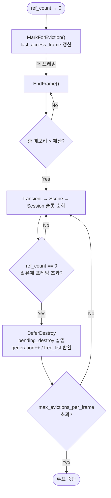
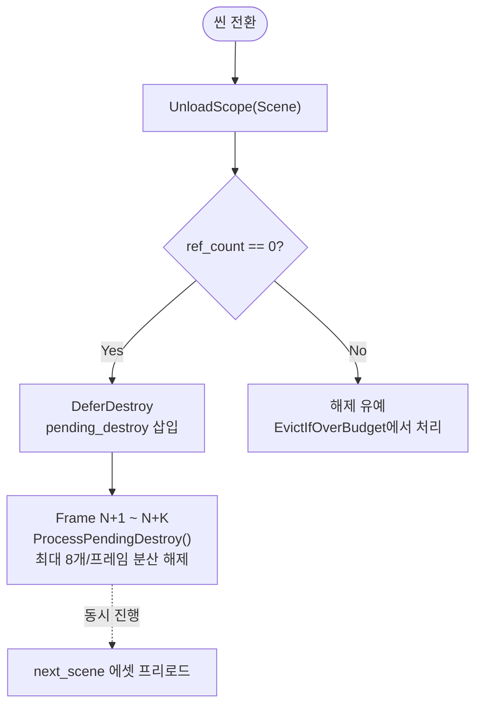
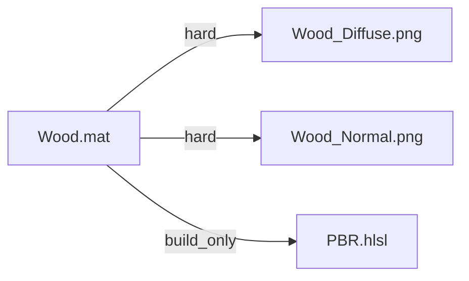
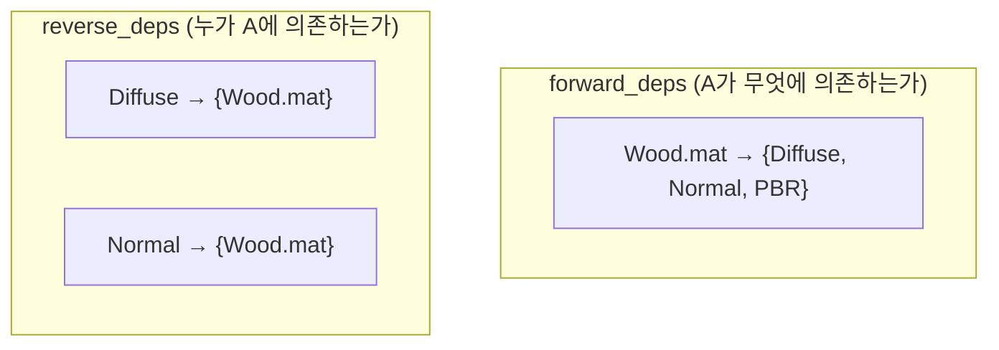
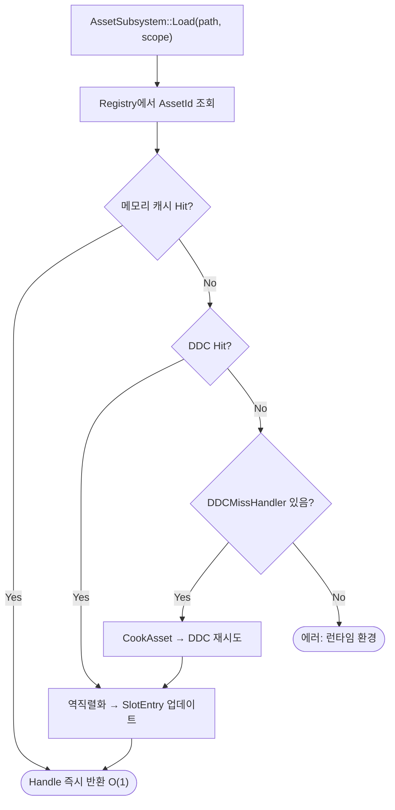
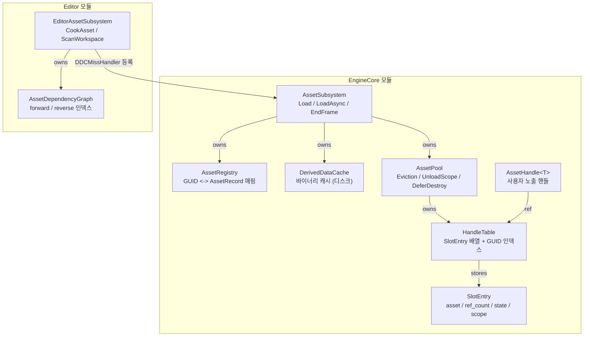

# Asset 수명 관리

> **한 줄 요약:** "참조 해제 시 즉시 제거"하는 기존 방식을 폐기하고, 예산 기반 LRU Eviction + 스코프 기반 수명 관리 + 분산 해제 시스템을 구축했다. 에셋 간 의존성은 `.meta` 파일을 기반으로 관리하며, 인메모리 `AssetDependencyGraph`를 통해 역참조를 수행한다.

**코드 진입점:**

- `EngineCore/Include/SimpleEngine/Asset/AssetPool.h` - Eviction, Budget, Scope 통합
- `EngineCore/Include/SimpleEngine/Asset/SlotEntry.h` - 에셋 슬롯 및 EScopeLayer 정의
- `EngineCore/Source/Asset/AssetPool.cpp` - EvictIfOverBudget, ProcessPendingDestroy
- `EngineCore/Source/Asset/AssetSubsystem.cpp` - EndFrame, LoadAsync
- `Editor/Include/SimpleEditor/Asset/AssetDependencyGraph.h` - 에디터 전용 의존성 그래프
- `Editor/Source/Asset/EditorAssetSubsystem.cpp` - CookAsset(의존성 기록)

---

## 1. 기존 시스템의 문제점

프로젝트 초기의 `AssetCache`는 에셋 핸들이 더 이상 참조되지 않으면 메모리에서 즉시 제거하는 방식을 사용했다. 구현은 단순했으나 두 가지 아키텍처적 한계가 존재했다.

### 1.1. 에셋 스래싱(Asset Thrashing)

```cpp
// 기존 CollectGarbage() 구현
uint32 AssetPool::CollectGarbage()
{
    return slots.RemoveIf([](const auto&, const auto& slot_ptr)
    {
        return slot_ptr.use_count() == 1; // 수명이 끝난 에셋을 즉시 제거
    });
}
```

해제된 에셋을 즉시 삭제함에 따라, 씬 전환 직후 동일한 에셋이 다시 요청되는 시나리오에서 디스크(DDC) 읽기 오버헤드가 반복되는 스래싱 문제가 발생했다.

### 1.2. 특정 프레임의 벌크 해제 병목

```cpp
void AssetSubsystem::EndFrame()
{
    pending_release.Clear(); // 수백 개의 에셋 소멸자가 한 프레임에 집중됨
}
```

씬 전환 시 대량의 에셋 소멸자가 단일 프레임에 동시에 호출되면서 프레임 타임 예산(16ms)을 초과하는 스터터링이 유발되었다.

---

## 2. 수명 관리 아키텍처 개선

### 2.1. 예산 기반 Eviction 정책

에셋의 `ref_count`가 0이 되면 즉시 해제하는 대신 `MarkForEviction()`을 통해 `last_access_frame`만 현재 프레임으로 갱신한다. 실제 메모리 해제는 `EndFrame()` 시점에 실행되는 `EvictIfOverBudget()`이 제어한다.



설정된 `grace_frames`(기본값 2프레임) 동안은 캐시 유예 기간을 가지므로, 짧은 시간 내에 재요청이 발생할 경우 디스크 I/O 없이 Cache Hit 경로를 타게 된다.

### 2.2. 스코프 기반 수명 관리

| 스코프 | 수명 | 예시 |
| -------- | ------ | ------ |
| `Global` | 엔진 프로세스 전체 | 기본 폰트, 에러 텍스처, 내장 셰이더 |
| `Session` | 게임 실행 ~ 종료 | HUD 텍스처, 플레이어 메시 |
| `Scene` | 현재 씬 수명 | 배경 텍스처, NPC 메시, 레벨 프롭 |
| `Transient` | 일회성 | 에디터 프리뷰, 임포트 중간물 |

씬 전환이 발생하면 `UnloadScope(EScopeLayer::Scene)`를 명시적으로 호출하여, 참조가 끝난(`ref_count == 0`) 해당 스코프의 에셋들을 `DeferDestroy`로 넘긴다.



### 2.3. 소멸자 프레임 분산 처리

대량의 무거운 에셋 소멸자가 메인 스레드를 점유하는 것을 막기 위해 지연 큐인 `ProcessPendingDestroy`에서 프레임당 최대 소멸자 호출 개수(`max_destructions_per_frame`)를 제한하여 처리한다.

```cpp
void AssetPool::ProcessPendingDestroy(u64 current_frame)
{
    usize write = 0;
    u32 total_released = 0;

    for (usize read = 0; read < pending_destroy.Len(); ++read)
    {
        PendingDestroyEntry& item = pending_destroy[read];

        // 유예 프레임이 경과하고, 현재 프레임 해제 예산이 남은 경우 제거
        if (item.release_frame <= current_frame && total_released < max_destructions_per_frame)
        {
            item.destructor(item.ptr);  // 실제 소멸자 호출
            ++total_released;
        }
        else
        {
            pending_destroy[write++] = std::move(item);  // 아직 유예 중 -> 보존
        }
    }
    pending_destroy.Truncate(write);
}
```

---

## 3. EScopeLayer 사용 방법

에셋을 로드할 때 수명 스코프를 인자로 전달한다. 생략할 경우 기본적으로 `Scene` 스코프가 적용된다.

```cpp
// 씬 수명과 동기화되는 에셋 로드 (기본값)
auto mesh = assets.Load<StaticMesh>("meshes/character.fbx", EScopeLayer::Scene);

// 게임 세션 전반에 걸쳐 유지되는 에셋 로드
auto hud_tex = assets.Load<Texture2D>("ui/hud_icons.png", EScopeLayer::Session);

// 엔진 수명과 일치하며 eviction 대상에서 제외되는 시스템 에셋 로드
auto error_tex = assets.Load<Texture2D>("engine://ErrorTexture.png", EScopeLayer::Global);
```

---

## 4. 의존성 그래프 (AssetDependencyGraph)

에셋 간 의존 관계를 추적하여 병렬 Cook 시 올바른 처리 순서를 결정하기 위해 의존성 그래프 레이어를 구축했다.

### 4.1. 의존성 구조

에셋 간 의존 관계는 `.meta` 파일에 기록되며, 스캔 시 `AssetDependencyGraph`가 이를 읽어 인메모리 인덱스를 구축한다.



```toml
# Wood_Material.fbx.meta
[[metadata.dependencies]]
vpath = "Assets://Textures/Wood_Diffuse.png"
guid  = "bbbbbbbb-cccc-dddd-eeee-ffffffffffff"
type  = "hard"

[[metadata.dependencies]]
vpath = "Assets://Shaders/PBR.hlsl"
type  = "build_only"
```

| 의존성 타입 | 의미 |
| ------------ | ---- |
| `hard` | 런타임에도 필요한 의존성. 변경 시 상위 에셋 Re-cook 대상 |
| `soft` | 참고용 의존성. Re-cook 트리거 안 함 |
| `build_only` | Cook 시에만 참조. 런타임 메모리에 로드 안 함 |

### 4.2. AssetDependencyGraph 구조

순방향/역방향 인덱스를 모두 유지하여 Cook 순서 결정(순방향)과 역참조 쿼리(역방향) 두 가지 용도를 커버한다.



인메모리 핵심 API:

```cpp
// Editor 모듈 전용 (런타임 빌드 제외)
class AssetDependencyGraph
{
public:
    void SetDependencies(AssetId id, ArrayView<const AssetId> deps);
    void RemoveNode(AssetId id);

    Array<AssetId> GetTransitiveDependents(AssetId root) const; // BFS 역참조
    bool HasCyclicDependency(AssetId from, AssetId to) const;
    Array<AssetId> TopologicalSort() const; // Kahn's Algorithm
};
```

`AssetDependencyGraph`는 `AssetRegistry`와 독립된 전용 `SharedMutex`를 소유하므로 멀티스레드 Cook 환경에서 락 경합이 발생하지 않는다.

---

## 5. 로드 흐름

에셋 로드 요청이 오면 아래 순서로 진행된다.



비동기 버전(`LoadAsync`)은 DDC Hit 경로에서 `co_await AsyncFileIO::ReadFileAsync()`를 사용하여 메인 스레드를 블로킹하지 않는다.

---

## 6. 클래스 구조

`AssetSubsystem`을 중심으로 한 소유 관계와 모듈 경계.



---

## 참고

- [Asset-Pipeline.md](./Asset-Pipeline.md) - Import 파이프라인, DDC, LoadAsync
- [Asset-Registry-And-Handle.md](./Asset-Registry-And-Handle.md) - GUID, Generational Handle, Frame-Epoch
- [Job-System-Architecture.md](../03_Concurrency/Job-System-Architecture.md) - 병렬 Cook Worker
- [Coroutine-Integration.md](../03_Concurrency/Coroutine-Integration.md) - LoadAsync의 co_await 연동
