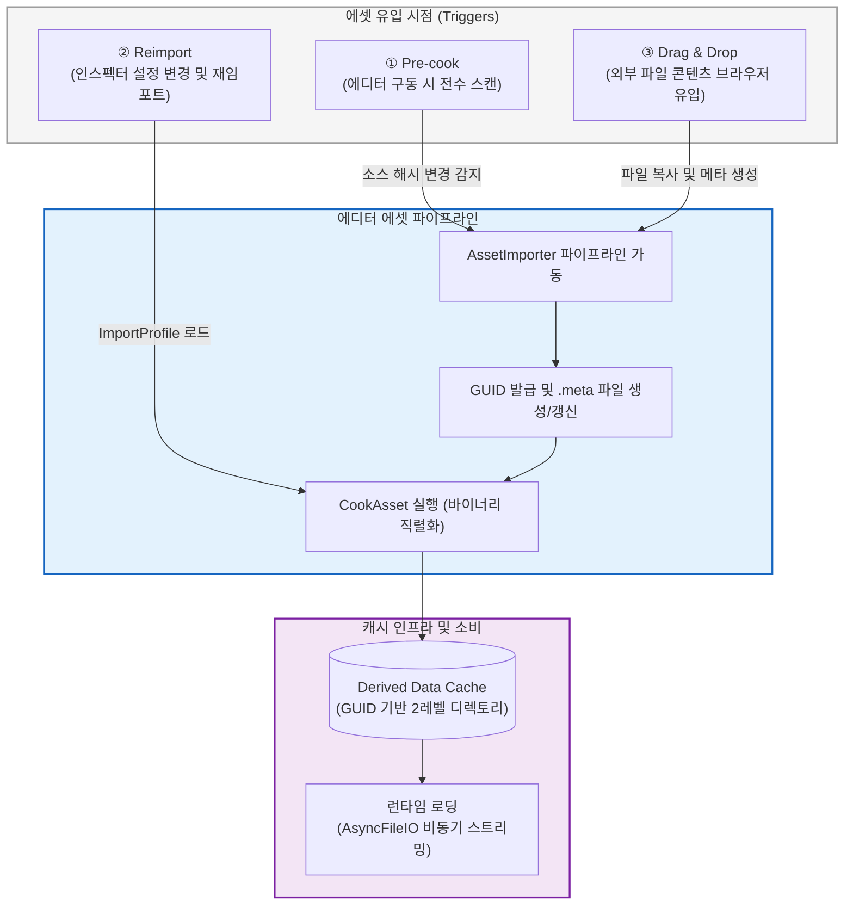
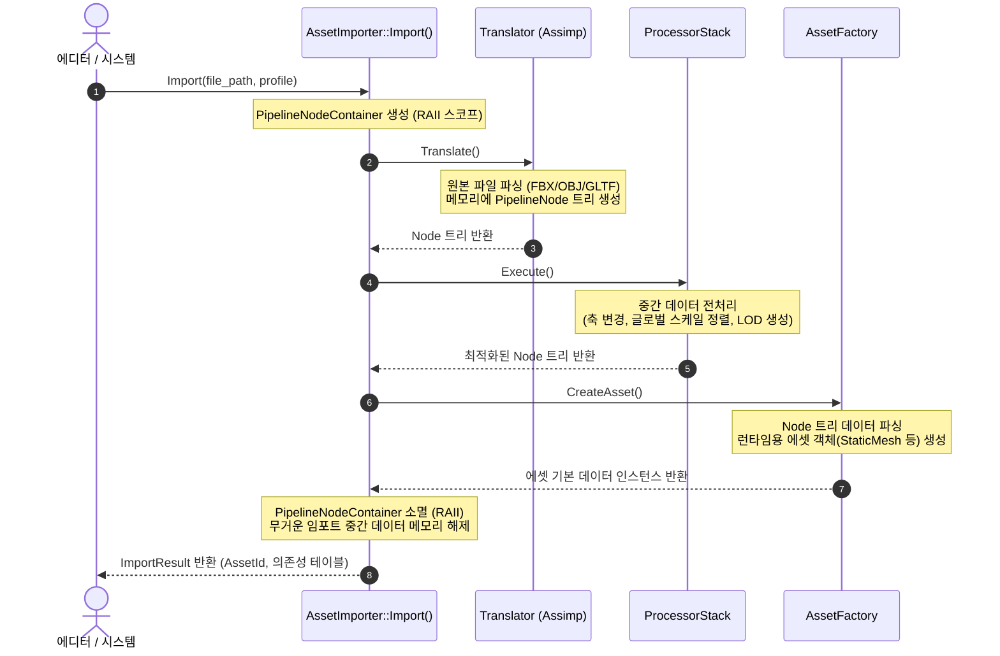
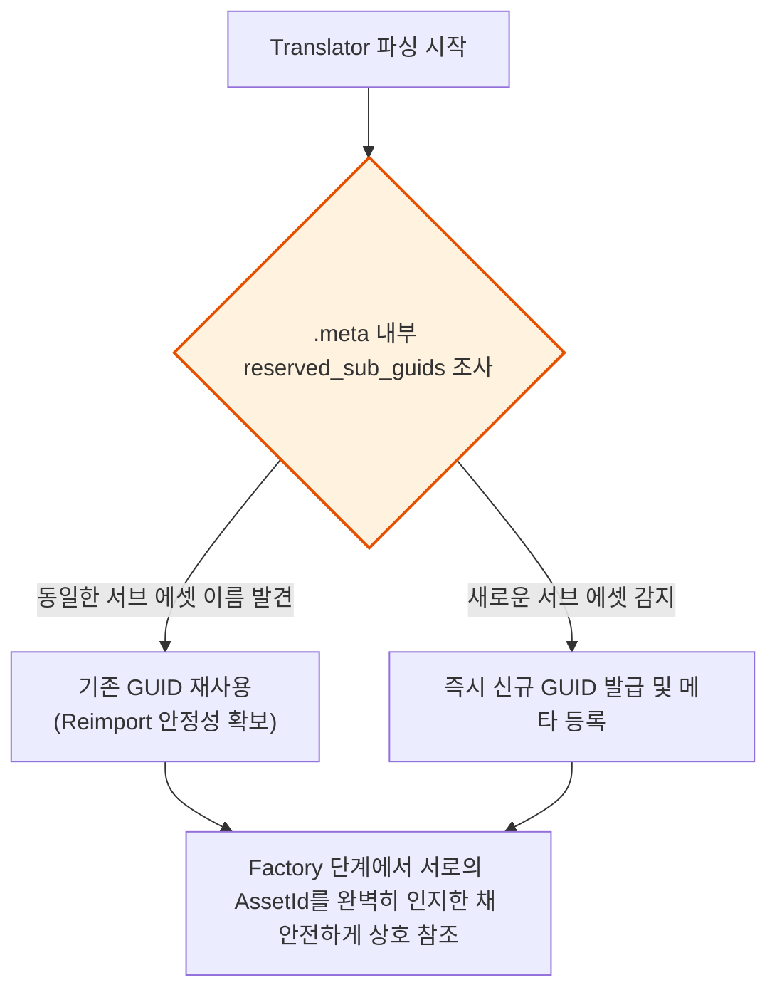
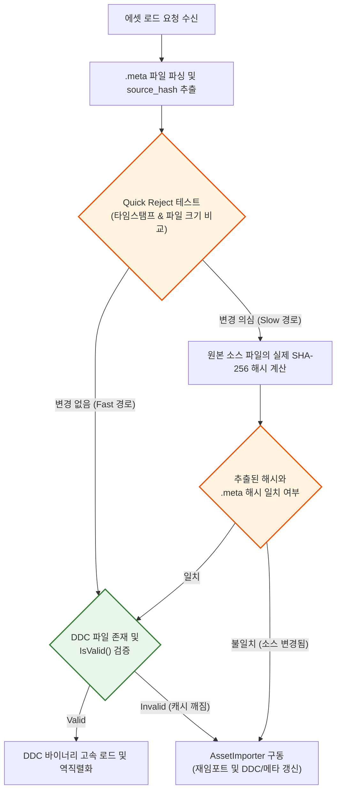

# Asset Import 파이프라인

> **한 줄 요약:** FBX, PNG 같은 외부 파일을 엔진이 실제로 쓸 수 있는 바이너리 에셋으로 변환하는 Import 파이프라인을 설계했다. Unreal Engine의 Interchange Framework를 참고했고, DDCMissHandler라는 Strategy Pattern으로 에디터/런타임 경계를 깔끔하게 나눴다.

**코드 진입점:**

- `Editor/Include/SimpleEditor/Asset/Pipeline/AssetImporter.h` - Import 파이프라인 진입점
- `Editor/Include/SimpleEditor/Asset/Pipeline/Translators/IPipelineTranslator.h` - Translator 인터페이스
- `Editor/Source/Asset/Pipeline/Translators/AssimpTranslator.cpp` - Assimp 기반 FBX/OBJ 번역기
- `Editor/Include/SimpleEditor/Asset/MetaFileManager.h` - .meta 파일 CRUD
- `EngineCore/Include/SimpleEngine/Asset/AssetSubsystem.h` - DDCMissHandler 주입점
- `EngineCore/Include/SimpleEngine/Asset/DerivedDataCache.h` - DDC 읽기/쓰기
- `Editor/Source/Asset/EditorAssetSubsystem.cpp` - CookAsset, ScanWorkspace, MakeCookTask

---

## 1. 왜 Import 파이프라인이 필요했나

프로젝트 초기 단계의 구현은 단순히 에셋 로딩 요청이 들어왔을 때 런타임에서 Assimp 라이브러리를 사용하여 FBX나 OBJ 같은 외부 포맷 파일을 실시간으로 파싱 후 메모리에 올리는 방식이었다. 하지만 프로젝트 규모가 커지자 이 구조는 명확한 아키텍처적 한계와 마주하게 되었다.

가장 큰 문제는 **런타임 라이브러리 오염**이었다. 배포 빌드(Shipping) 단계의 게임 실행 파일에 굳이 포함될 필요가 없는 임포트 전용 무거운 라이브러리들이 통째로 링크되는 것은 구조적으로 결함이 있었다.

여기에 덧붙여 **FBX 파싱 특유의 심각한 성능 저하**가 발목을 잡았다. 씬을 로드할 때마다 수백 MB에 달하는 원본 소스 데이터를 매번 처음부터 해석하고 정점 데이터를 재구성하는 방식은 실무적으로 불가능에 가까웠다.

이러한 고충을 해결하기 위해 언리얼 엔진 5의 Interchange Framework 아키텍처를 벤치마킹하여 두 가지 핵심 설계 원칙을 수립했다.

1. **Import는 철저히 에디터 전용 연산이다:** 런타임 환경에서는 원본 외부 파일을 직접 파싱하는 행위를 원천 배제한다. Assimp와 같은 임포터 모듈 및 외부 종속성은 배포 빌드에서 완전히 격리한다.
2. **런타임은 DDC(Derived Data Cache)만 소비한다:** 에디터 파이프라인이 백그라운드에서 미리 변환해 둔 엔진 전용 바이너리 페이로드만 로드한다. 원본 소스 대신 직렬화된 가벼운 커스텀 메시 데이터를 메모리에 스트리밍하므로 로딩 속도를 압도적으로 끌어올릴 수 있다.

---

## 2. Import가 일어나는 세 가지 시점

엔진 내부에서 외부 소스 파일이 감지되어 에셋 파이프라인이 구동되는 시점은 크게 세 가지 시나리오로 분류된다. 각 시점에서 변환된 결과물은 최종적으로 DDC로 일괄 수렴하여 런타임의 비동기 로딩 파이프라인으로 전달된다.



1. **Pre-cook (에디터 시작 시):** 에디터가 구동될 때 `EditorAssetSubsystem::ScanWorkspace()`가 프로젝트 에셋 폴더 전체를 순회한다. 소스 파일을 탐색하여 누락된 `.meta` 파일을 자동 생성하고, 원본의 소스 해시(SHA-256)를 검사하여 DDC가 유효한지 추적한다. 변경점이 확인된 Dirty 파일들은 목록에 캐싱되어 백그라운드 병렬 Cook 태스크로 이어진다.

2. **Reimport (명시적 재임포트):** 에디터 인스펙터 창에서 세팅을 변경하거나 사용자가 "Reimport"를 수동으로 발동하는 시점이다. 해당 에셋과 매핑된 `.meta` 파일에서 `ImportProfile` 설정을 읽어 들인 후, 변경된 옵션을 기반으로 `CookAsset()`을 호출하여 기존 캐시를 강제로 갱신한다.

3. **Drag & Drop (외부 파일 유입):** 외부 탐색기에서 엔진의 에셋 브라우저로 원본 파일을 드래그 앤 드롭할 때, 파일을 즉시 프로젝트 디렉토리 내부로 복사하고, 고유 식별을 위한 `.meta` 파일을 실시간으로 발급한 뒤 지체 없이 `CookAsset()` 파이프라인을 구동한다.

---

## 3. 파이프라인 내부 동작 원리

에셋 파이프라인의 핵심은 `AssetImporter::Import()` 이다. 이 안에서 에디터 전용 중간 데이터 저장소인 `PipelineNodeContainer`를 구축하고, 번역(Translate) -> 전처리(Process) -> 생성(Factory)이라는 명확히 격리된 3단계 파이프라인을 순서대로 실행한다.



### 3.1. `.meta` 파일 포맷

각 원본 소스 파일이 유입되면 동일한 디렉토리 위치에 TOML 포맷을 채택한 `<파일명>.meta` 파일이 자동으로 쌍을 이루어 생성된다.

```toml
# Assets/Meshes/character.fbx.meta
[asset]
guid = "550e8400-e29b-41d4-a716-446655440000"
source_hash = "sha256:a1b2c3d4e5f6..."
importer_type = "se::AssimpTranslator"
cache_version = 1

[import_settings]
combine_meshes = true
apply_transform = true
global_scale = 1.0

[[sub_assets]]
name = "Mesh_Character"
guid = "550e8400-e29b-41d4-a716-446655440001"
type = "se::StaticMesh"

[[sub_assets]]
name = "Material_Body"
guid = "550e8400-e29b-41d4-a716-446655440002"
type = "se::Material"
```

인프라 레벨에서 `.meta` 파일이 담당하는 역할은 크게 세 가지로 요약된다.

1. **고유 GUID 맵핑:** 파일에 영구적인 `guid`를 부여함으로써, 추후 프로젝트 폴더 내에서 파일 경로가 바뀌거나 이름이 변경되더라도 다른 에셋들이 해당 리소스를 잃어버리지 않고 추적할 수 있게 방어한다.
2. **변경점 감지:** `source_hash` 필드에 원본 파일의 검증 데이터를 보존하여 소스 갱신 여부를 정밀하게 추적한다.
3. **설정 영속화:** `import_settings`를 통해 개발자가 바꾼 세부 임포트 옵션을 보존한다.

결과적으로 이 메타 파일만 있으면 언제든 캐시를 똑같이 복구할 수 있으므로, `.meta` 파일은 버전 관리 시스템(VCS)의 추적 대상에 포함하고 변환된 거대한 결과물인 DDC 폴더는 `.gitignore`로 가볍게 제외하는 협업 환경을 구축했다.

### 3.2. Sub-asset GUID 발급

하나의 거대한 FBX 소스 파일 안에는 단일 메시뿐만 아니라 복수의 서브 메시, 머티리얼, 스켈레톤 등 수많은 하위 리소스(**Sub-asset**)들이 얽혀서 들어온다. 파이프라인을 구축할 때 이 하위 리소스들에 어떻게 고유하고 영속적인 GUID를 부여할 것인가가 가장 까다로운 난제였다.

초기 설계에서는 모든 변환(Cook)이 끝난 시점에 최종 에셋들을 전수 조사하여 순차적으로 GUID를 매기려 했다. 하지만 이 방식은 심각한 모순에 부딪혔다. Factory가 작동하는 도중에는 아직 생성되지 않은 형제 서브 에셋들의 `AssetId`를 미리 조회할 수 없었던 것이다. 예를 들어 `MaterialFactory`가 텍스처를 참조하여 세팅해야 하는데, 그 텍스처의 식별자가 아직 결정되지 않아 의존성 바인딩이 꼬이는 병목이 발생했다.

이를 해결하기 위해 **Translator가 원본 소스를 파싱하는 최초 단계에서 서브 에셋 GUID를 먼저 발급**하는 아키텍처로 변경했다.



번역 단계에서 `ImportContext::AllocateSubAssetGuid(name)`을 호출하면 메타 파일 내역을 추적하여, 기존에 썼던 이름이면 저장된 GUID를 그대로 재사용하고 신규 노드일 때만 새로 발급을 하게된다. 이 덕분에 소스 데이터를 몇 번을 다시 임포트(Reimport)하더라도 서브 에셋들의 고유 식별자가 절대로 요동치지 않고 고정되어, 에셋 간의 복잡한 의존성 체인을 런타임 직전 단계에서 완벽하게 상호 참조시킬 수 있게 되었다.

---

## 4. DDC (Derived Data Cache)

DDC(Derived Data Cache)는 에셋 파이프라인의 성능을 책임지는 핵심 저장소다. 복잡한 임포트 과정을 거쳐 생성된 최종 결과물들을 엔진이 바로 역직렬화할 수 있는 전용 바이너리 형태로 저장해 두는 로컬 캐시 인프라다.

파일 시스템의 오버헤드를 줄이기 위해, 에셋 고유 GUID의 앞 2자리를 서브 디렉토리 이름으로 활용하는 **2레벨 폴더 아키텍처**를 채택했다. 이는 단일 디렉토리에 수만 개의 캐시 파일이 몰려 OS 파일 시스템의 룩업(Lookup) 성능이 저하되는 현상을 방지하기 위함이다.

```text
Project/
 ├── Assets/
 │    └── textures/
 │         ├── diffuse.png
 │         └── diffuse.png.meta        <- 고유 GUID 및 소스 해시 보존 (VCS 추적 대상)
 └── DerivedDataCache/                 <- 로컬 생성 캐시 (.gitignore 대상)
      └── 55/
           └── 550e8400-...0000.cache  <- GUID 기반 2레벨 파티셔닝 저장
```

캐시 파싱 오버헤드를 최소화하기 위해 캐시 파일의 헤더는 매직/버전/소스 해시/페이로드 크기를 앞단에 배치한 단순한 형태로 설계했다.

```text
[4 bytes]    Magic Number: "SEDC" (SimpleEngine Derived Cache)
[4 bytes]    Format Version: uint32
[8+N bytes]  Source Hash: String (length-prefixed)
[4 bytes]    Cache Schema Version: uint32  (Importer 출력 포맷 변경 시 증가)
[8 bytes]    Payload Size: uint64
[M bytes]    Payload Data: MemoryArchive로 직렬화된 순수 정점/텍스처 바이너리
```

### 4.1. DDC 유효성 검증 파이프라인

에셋 로드 요청이 감지되면 시스템은 무조건 캐시를 새로 만드는 대신, 아래와 같은 검증 파이프라인을 거쳐 캐시의 재사용 가능 여부를 판정한다.



에셋 로드 요청이 들어오면 시스템은 무조건 캐시를 생성하는 대신 내부 검증 파이프라인을 거치는데, 이때 성능 향상을 위해 **Quick Reject** 기법을 사용한다. 매번 에셋을 읽을 때마다 소스 파일의 전체 SHA-256 해시를 계산하는 대신, OS 단의 파일 수정 타임스탬프와 크기(Size) 정보만 빠르게 비교하여 변화가 감지되었을 때만 실제 해싱 연산을 수행하도록 설계하여 불필요한 연산 낭비를 차단했다.

또한 DDC 파일을 디스크에 기록할 때는 캐시 오염을 막기 위해 **Atomic Write(Rename)** 방식을 채택했다. 타겟 경로에 직접 바이너리를 쓰다가 프로세스가 강제 종료되면 기존 캐시까지 훼손되므로, 항상 별도의 임시 파일(`.tmp`)에 쓰기를 완료한 후, OS 수준에서 원자적으로 이름을 변경하도록 설계했다.

---

## 5. 전략 패턴을 통한 에디터/런타임 경계 분리 (`DDCMissHandler`)

초기에는 `EImportPolicy` 플래그를 사용하여 Core 모듈 내부에서 에디터 환경 여부를 판단했다. 이 방식은 하위 모듈인 Core가 상위 모듈인 에디터의 개념을 인지하게 만들어 모듈 간 결합도를 높이는 문제가 있었다.

이를 해결하기 위해 **`DDCMissHandler` 전략 패턴**을 도입했다.

```cpp
// EngineCore/Include/SimpleEngine/Asset/AssetSubsystem.h
using DDCMissHandler = Function<bool(AssetSubsystem& subsystem, const VPath& file_path)>;

class SE_CORE_API AssetSubsystem : public SubsystemBase
{
public:
    void SetDDCMissHandler(DDCMissHandler handler);

private:
    DDCMissHandler ddc_miss_handler;
};
```

`AssetSubsystem`은 에셋 로드 중 DDC 캐시가 누락되면 직접 임포트를 트리거하는 대신, 등록된 핸들러를 호출한다.

```cpp
// EngineCore/Source/Asset/AssetSubsystem.cpp 내부
if (!registry->IsFileImported(file_path))
{
    if (ddc_miss_handler)
    {
        // 에디터 환경: 주입된 쿡 파이프라인 가동
        if (!ddc_miss_handler(*this, file_path)) { return nullptr; }
    }
    else
    {
        // 런타임 환경: 캐시 누락을 에러 처리
        ConsoleLog(ELogLevel::Error, "DDC miss: asset not cooked. path={}", file_path);
        return nullptr;
    }
}
```

에디터 모듈은 초기화 시점에 `CookAsset` 멤버 함수를 람다 형태로 주입한다.

```cpp
// Editor/Source/Asset/EditorAssetSubsystem.cpp
bool EditorAssetSubsystem::Initialize()
{
    // ... importer/factory 등록 생략 ...
    GetSubsystemChecked<AssetSubsystem>().SetDDCMissHandler(
        [this](AssetSubsystem&, const VPath& file_path) -> bool
        {
            return CookAsset(file_path);
        }
    );
    // ...
}
```

Core 모듈은 핸들러의 시그니처만 알 뿐 구체적인 임포트 로직은 알지 못한다. 런타임 빌드에서는 핸들러 바인딩을 생략하므로 캐시 미스 상황이 컴파일 타임 에러 없이 원천 차단된다.

| 항목 | `EImportPolicy` 분기 (이전) | `DDCMissHandler` 결합 (현재) |
| --- | --- | --- |
| **Core / Editor 결합** | Core 내부에 에디터 상태 조건문 침투 | Core는 시그니처만 인지하며 의존성 단절 |
| **정책 확장성** | 새로운 빌드 환경 대응 시 분기문 추가 필요 | 상위 레이어에서 새로운 람다 주입으로 해결 |
| **유닛 테스트** | 빌드 설정을 강제하거나 상태 조작 필요 | Mock 핸들러 주입으로 손쉽게 검증 가능 |

---

## 6. Background Cook을 통한 에디터 구동 병렬화

기존 `ScanWorkspace()`는 워크스페이스 스캔 중 캐시 변경이 감지되면 메인 스레드에서 즉시 `CookAsset()`을 동기식으로 실행했다. 이로 인해 에디터 초기 구동 시간이 파일 개수에 비례해 늘어났다.

이를 개선하기 위해 스캔과 쿡 단계를 분리하고, Job System을 통해 백그라운드에서 병렬로 Cook 태스크를 처리하도록 변경했다.

```cpp
// 워크스페이스 스캔 (메인 스레드)
Array<VPath> dirty_files;
// ... 스캔 후 IsAssetDirty() 감지 시 dirty_files에 추가 ...

// 병렬 Cook 디스패치 (Job System)
Array<JobHandle> cook_handles;
for (const VPath& vpath : dirty_files)
{
    cook_handles.Add(JobSystem::Get().SubmitTask(MakeCookTask(*this, vpath)));
}

// 완료 대기 및 의존성 빌드
for (JobHandle& h : cook_handles) { h.Wait(); }
BuildDependencyGraph();
```

---

## 7. 기술적 한계 및 과제

현재 `LoadAsync` 비동기 스트리밍 인프라는 구현되어 있으나, 메인 런타임 루프에서는 비활성화하고 동기식 로드만 사용 중이다.

이 문서를 쓸 당시에 `void`뿐만 아니라 임의의 타입을 받을 수 있는 `JobTask<T>`를 [사용할 수 있도록 개선](https://github.com/gudtldn/SimpleEngine/pull/42)해서 나중에 시간이 될 때 `LoadAsync`기반으로 다듬을 생각이다.

---

## 참고

- [Asset-Registry-And-Handle.md](./Asset-Registry-And-Handle.md) - GUID 기반 식별 및 Generational Handle
- [Asset-Cache-And-Lifecycle.md](./Asset-Cache-And-Lifecycle.md) - 로드된 에셋 수명 관리
- [Coroutine-Integration.md](../03_Concurrency/Coroutine-Integration.md) - AsyncFileIO, stateless lambda 제약
- [Job-System-Architecture.md](../03_Concurrency/Job-System-Architecture.md) - JobSystem::SubmitTask
