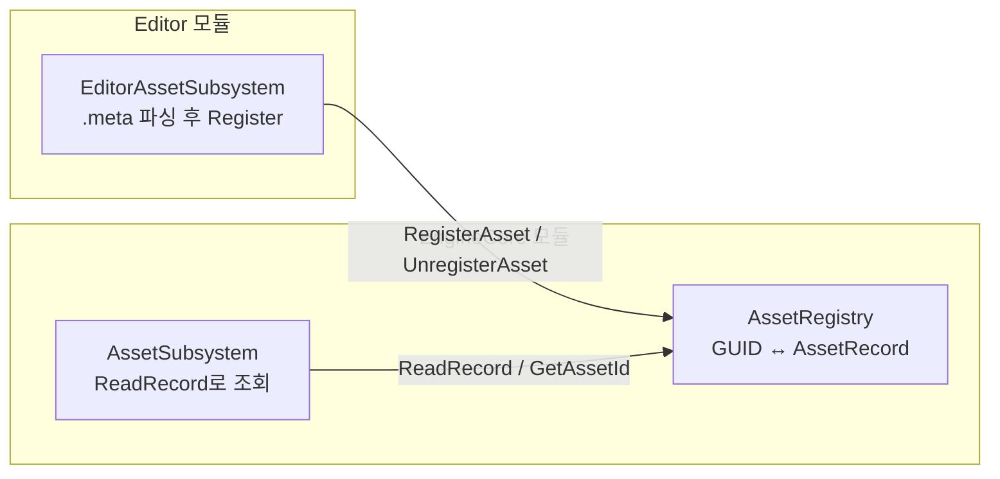
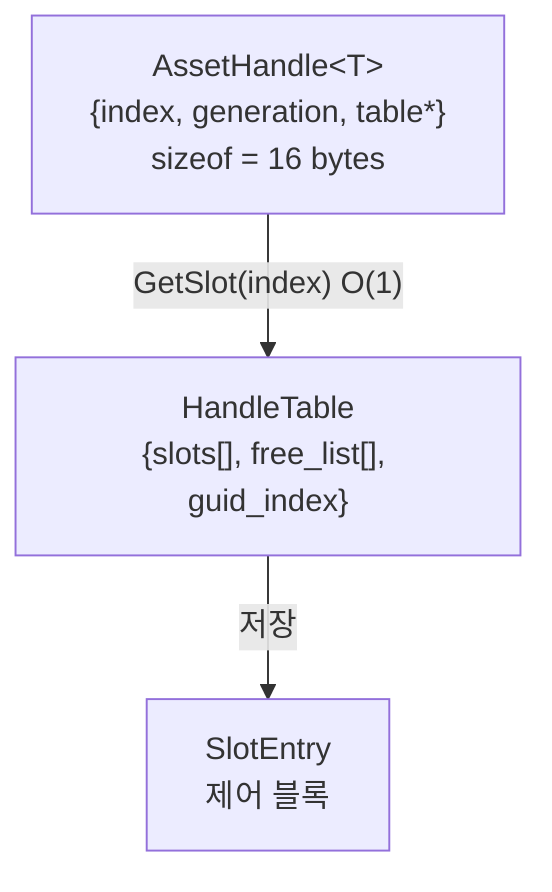
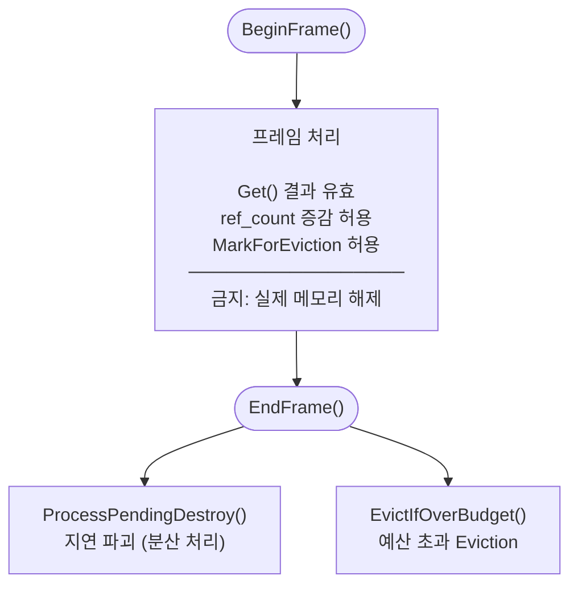

# Asset 식별과 핸들

> **한 줄 요약:** 경로 기반 참조의 깨짐 문제를 해결하기 위해 GUID 기반 `AssetRegistry`를 설계했고, `shared_ptr` 체인의 atomic 낭비와 즉시 GC의 한계를 극복하기 위해 Generational Handle Table로 전환했다.

**코드 진입점:**

- `EngineCore/Include/SimpleEngine/Asset/AssetRegistry.h` - GUID ↔ AssetRecord 매핑 저장소
- `EngineCore/Include/SimpleEngine/Asset/AssetId.h` - GUID 기반 식별자
- `EngineCore/Include/SimpleEngine/Asset/AssetHandle.h` - Generational Handle
- `EngineCore/Include/SimpleEngine/Asset/SlotEntry.h` - Handle Table 슬롯 제어 블록
- `EngineCore/Include/SimpleEngine/Asset/HandleTable.h` - Dense Array + free_list
- `EngineCore/Include/SimpleEngine/Core/FileSystem/VFS.h` - 가상 파일 시스템

---

## 1. 왜 경로 대신 GUID인가

`AssetSubsystem::Load<StaticMesh>("Assets://Meshes/character.fbx#Mesh_Body")`처럼 경로로 참조하면, 파일 이름이나 폴더 구조가 바뀌는 순간 참조가 깨지고 씬 파일에 박혀있는 경로 문자열 수백 개를 전부 고쳐야 한다.

`.meta` 파일 생성 시점에 UUID를 발급하여 `AssetId`로 에셋을 식별하면, 파일을 이동하거나 이름을 바꿔도 `.meta` 파일이 함께 이동하기 때문에 참조가 유지된다. `AssetRegistry`가 GUID ↔ `AssetPath` 매핑을 관리하고, 에디터가 `.meta`를 파싱해서 Registry에 주입하면 런타임은 Registry를 조회만 한다.

---

## 2. AssetRegistry 구조

Registry는 EngineCore 모듈에 위치하지만 데이터를 스스로 채우지 않는다. Editor가 `.meta`를 파싱하여 `RegisterAsset`으로 주입하는 단방향 구조이고, Core는 Editor를 전혀 모른다.



내부 데이터는 세 개의 인덱스로 구성된다:

```cpp
HashMap<AssetId, AssetRecord>      records;        // 핵심 데이터
HashMap<AssetPath, AssetId>        path_to_id;     // 경로 → ID 역방향 인덱스
HashMap<VPath, Array<AssetId>>     file_to_assets; // 소스 파일별 sub-asset 목록
```

`AssetRecord`는 에셋 하나의 전체 정보를 담는 구조체다:

```cpp
struct AssetRecord
{
    AssetId       id;
    TypeId        type;
    AssetPath     logical_path; // "Assets://Meshes/character.fbx#Mesh_Body"
    AssetMetadata metadata;     // import 설정, 의존성, 해시 등
};
```

직접 필드를 꺼내는 `GetMeta(id)` / `GetAssetPath(id)` 같은 함수 대신 `ReadRecord(id, callback)` 패턴을 채택했다. shared_lock을 잡은 채 콜백 안에서 데이터를 소비하므로, 조회 시 `AssetRecord` 복사 없이 락 범위 안에서 처리가 끝난다.

```cpp
registry.ReadRecord(asset_id, [](const AssetRecord& record)
{
    // shared_lock 범위 안에서 실행 — 복사 없음
    use(record.type, record.metadata);
});
```

에디터가 닫힐 때 Registry를 바이너리로 저장(`SaveToFile`)해두면, 다음 실행 시 `.meta` 파일을 하나하나 다시 파싱하지 않고 스냅샷에서 바로 복원할 수 있다(Hot Start).

---

## 3. VPath와 AssetPath

절대 경로를 코드에 박으면 빌드 환경이 바뀔 때마다 경로가 깨지기 때문에 가상 경로(`VPath`)를 도입했다.

```
Assets://Textures/Player.png      → "Assets" 스킴으로 마운트된 물리 경로 기준
CoreAssets://Font/malgun.ttf      → "CoreAssets" 스킴으로 마운트된 물리 경로 기준
```

`VFS::Mount(scheme, physical_path)`로 스킴과 실제 경로를 연결하면, 이후 파일 접근 코드는 VPath만 사용한다. 에디터 실행 환경과 패키징 배포 환경에서 파일 I/O 코드가 동일해진다.

`AssetPath`는 VPath에 sub-asset 이름을 붙인 식별자다. `.fbx` 파일 하나에서 여러 메시가 추출될 수 있으므로 파일 경로(`file_path`)와 sub-asset 이름(`sub_asset_name`)을 분리해서 관리한다.

```
"Assets://Characters/Hero.fbx#Mesh_Body"
 ├ file_path:       "Assets://Characters/Hero.fbx"
 └ sub_asset_name:  "Mesh_Body"
```

---

## 4. shared_ptr를 버린 이유

원래 `AssetHandle<T>`는 두 단계의 `shared_ptr` 체인이었다.

```
AssetHandle<T>  ==  shared_ptr<AssetSlot>
AssetSlot            └─ shared_ptr<AssetBase>
```

에셋 하나를 꺼내 쓰려면 `shared_ptr<AssetSlot>`을 복사하고(AssetSlot refcount ++), 내부 `shared_ptr<AssetBase>`도 따로 관리해야 했다(AssetBase refcount ++). 렌더러가 매 프레임 수십 개의 핸들을 복사하면 atomic 연산이 쌍으로 쌓인다.

더 근본적인 문제는 GC 방식이었다.

```cpp
uint32 AssetPool::CollectGarbage()
{
    return slots.RemoveIf([](const auto&, const auto& slot_ptr)
    {
        return slot_ptr.use_count() == 1; // 핸들 없으면 즉시 제거
    });
}
```

핸들이 사라지는 즉시 GC 대상이 되므로, 씬 전환 직후 동일한 에셋이 다시 요청되는 시나리오에서 방금 해제한 에셋을 디스크에서 다시 읽어야 하는 Thrashing이 발생했다.

`EndFrame()`의 벌크 해제도 문제였다.

```cpp
void AssetSubsystem::EndFrame()
{
    pending_release.Clear(); // 씬 전환 시 수백 개 소멸자가 한 프레임에 집중
}
```

---

## 5. Generational Handle Table로 전환

ECS의 SparseSet Entity ID(`{index, generation}`)에서 영감을 받아 Generational Handle Table로 전환했다.



### HandleData

HandleTable이 발급하는 핸들 값. ECS의 `Entity({id, generation})`와 동일한 패턴이다.

```cpp
struct HandleData
{
    u32 index = INVALID_INDEX;
    u32 generation = INVALID_GENERATION;
};
```

### SlotEntry

에셋 하나의 제어 블록. Atomic 필드와 Non-atomic 필드를 명확히 구분한다.

```cpp
struct SlotEntry
{
    // === Atomic fields (lock-free 접근 가능) ===
    std::atomic<AssetBase*>    asset = nullptr;
    std::atomic<u32>           ref_count = 0;
    std::atomic<ELoadingState> state = ELoadingState::Unloaded;
    std::atomic<u64>           last_access_frame = 0;

    // === Non-atomic fields (pool_mutex 하에서만 변경) ===
    u32          generation = 0;         // 슬롯 재사용 시 ++, stale 핸들 감지용
    TypeId       asset_type;
    AssetPath    source_path;
    AssetId      asset_id;
    DestructorFn destructor = nullptr;   // 리플렉션 소멸자
    u64          asset_size_bytes = 0;
    EScopeLayer  scope = EScopeLayer::Scene;
    ESlotState   slot_state = ESlotState::Free;
};
```

`destructor` 함수 포인터가 필요한 이유: 에셋은 리플렉션 시스템의 `constructor()`로 할당되므로, 해제할 때도 `delete` 대신 리플렉션 소멸자를 호출해야 올바르게 정리된다. `shared_ptr`의 커스텀 deleter가 하던 역할을 SlotEntry가 직접 들고 다니는 셈이다.

### HandleTable

```cpp
class HandleTable
{
    Array<SlotEntry>       slots;       // Dense Array — 인덱스로 O(1) 접근
    Array<u32>             free_list;   // LIFO 재사용 스택
    HashMap<AssetId, u32>  guid_index;  // GUID → 슬롯 인덱스
    std::atomic<u64>       total_memory;
    TracySharedLockable(..., pool_mutex);
};
```

슬롯이 해제되면 인덱스가 `free_list`에 쌓이고, 다음 에셋 생성 시 재사용된다. 재사용 시 `generation`을 +1하므로, 이미 해제된 슬롯을 가리키던 낡은 핸들(stale handle)을 즉시 감지할 수 있다.

### AssetHandle\<T\>

```cpp
template <typename T>
    requires std::derived_from<T, AssetBase>
class AssetHandle
{
    u32          index      = INVALID_INDEX;
    u32          generation = INVALID_GENERATION;
    HandleTable* table      = nullptr;

public:
    T* Get() const
    {
        const SlotEntry& entry = table->GetSlot(index);
        if (entry.generation != generation) return nullptr; // stale 감지
        return static_cast<T*>(entry.asset.load(std::memory_order_acquire)); // lock-free
    }

private:
    void Release()
    {
        if (table->GetSlot(index).ref_count.fetch_sub(1, std::memory_order_acq_rel) == 1)
        {
            table->MarkForEviction(index); // last_access_frame 갱신, 즉시 해제 안 함
        }
    }
    // 복사 생성자: ref_count.fetch_add(1)  ← atomic 1회
};
```

| 연산 | shared_ptr 체인 | AssetHandle (현재) |
|------|-----------------|-------------------|
| 복사 | atomic × 2 (슬롯 + 에셋 refcount) | atomic × 1 |
| Get() | shared_ptr::get() | 배열 인덱싱 + generation 비교 + atomic::load |
| ref_count → 0 | 즉시 GC 대상 | MarkForEviction → EndFrame에서 처리 |

---

## 6. Frame-Epoch Safety Model

`Get()`이 raw pointer를 반환하는 구조에서 가장 큰 위험은, 반환된 포인터를 사용하는 도중 다른 스레드가 에셋을 해제하면 Use-After-Free가 된다는 것이다. `shared_ptr` 체인에서는 핸들이 살아있으면 refcount ≥ 2 이므로 GC가 건드리지 못했지만, raw pointer로 전환하면 이 보장이 사라진다.

해결책이 **Frame-Epoch Safety Contract**다.

> **핵심 불변식:** "어떤 에셋도 프레임 도중에 메모리에서 해제되지 않는다. 모든 실제 메모리 해제는 `EndFrame()`에서만 발생한다."



`ref_count`가 0이 되면 `MarkForEviction()`이 `last_access_frame`만 갱신하고, 실제 해제는 `EndFrame()`까지 유예된다. 따라서 프레임 도중 `Get()`으로 받은 raw pointer는 `EndFrame()` 전까지 유효함이 보장된다.

`SlotEntry::ExchangePayload()`도 같은 계약을 따른다. 에셋 Payload(포인터 + 소멸자)를 교체할 때 이전 Payload를 즉시 해제하지 않고 반환하며, 호출자는 반환된 Payload를 최소 1프레임 동안 `pending_destroy`에 보관해야 한다. 같은 프레임에서 `Get()`으로 이전 포인터를 이미 읽어둔 스레드가 있을 수 있기 때문이다.

---

## 참고

- [Asset-Pipeline.md](./Asset-Pipeline.md) - Import 파이프라인 및 .meta 구조
- [Asset-Cache-And-Lifecycle.md](./Asset-Cache-And-Lifecycle.md) - Eviction, Scope, DependencyGraph
- [ECS-Architecture.md](../04_ECS/ECS-Architecture.md) - SparseSet 패턴 (Handle Table의 영감)
