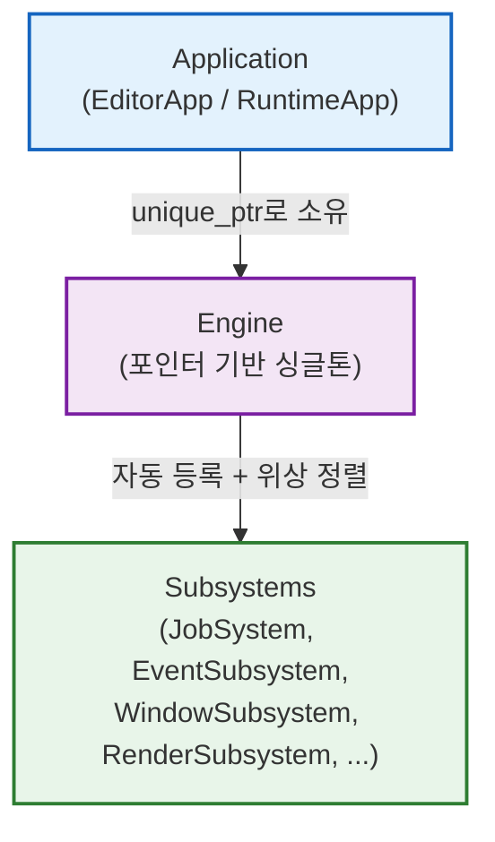
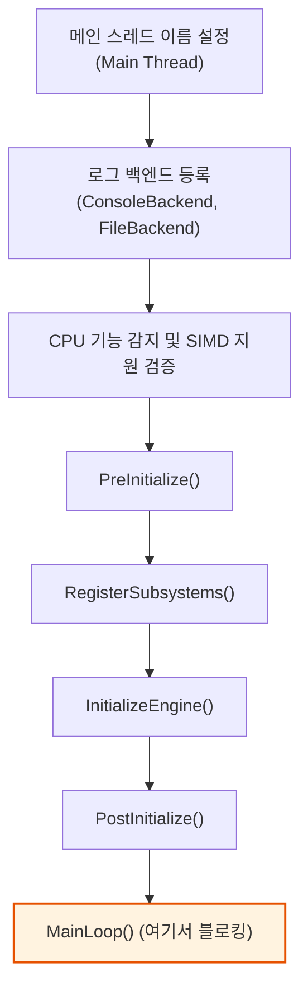
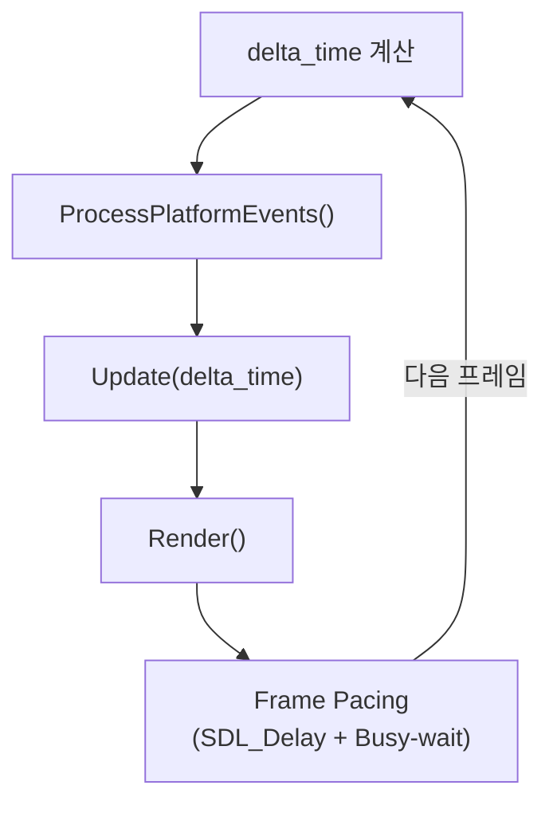

# 엔진 라이프사이클 - 부팅부터 종료까지

> **한 줄 요약:** `main()`에서 `Startup()`을 호출하면 로깅, SIMD 감지 -> VFS 마운트 -> Subsystem 등록 및 의존성 정렬 -> Main Loop(이벤트 -> 업데이트 -> 렌더) 순으로 진행되고, 루프 탈출 후 `Shutdown()`에서 GPU 대기 -> 역순 Release -> SDL 종료까지 이어진다.

**코드 진입점:**

- `EditorApp/Source/Launch.cpp` - 진입점 `main()`
- `EngineCore/Include/SimpleEngine/App/Application.h` - 전체 수명 주기 인터페이스
- `EngineCore/Source/App/Application.cpp` - Startup / Shutdown / MainLoop 구현
- `EngineCore/Include/SimpleEngine/Core/Engine/Engine.h` - Subsystem 관리 및 UpdateFrame
- `EngineCore/Source/Core/Engine/Engine.cpp` - Initialize / Release / SortSubsystems 구현
- `Editor/Source/App/EditorApplication.cpp` - 에디터 전용 오버라이드

---

## 1. 전체적인 아키텍처 구조

엔진은 크게 3개의 계층으로 작동한다.



1. **Application 계층:** 전체 수명 주기(Startup / Shutdown)와 Main Loop를 담당한다. Editor와 Runtime이 빌드 프로젝트(EditorApp / RuntimeApp)를 달리하며, `EditorApplication`이 `Application`을 상속해 에디터 전용 동작을 오버라이드한다.
2. **Engine 계층:** Subsystem의 생성, 정렬, 업데이트, 해제를 담당하는 싱글톤이다. `Application`이 소유(`std::unique_ptr<Engine>`)하며, `JobSystem`과 `AsyncFileIO`도 Subsystem 관리 밖에서 Engine이 직접 보유한다.
3. **Subsystems 계층:** 실제 기능이 돌아가는 모듈들(JobSystem, EventSubsystem, WindowSubsystem, RenderSubsystem, EntitySubsystem 등)이다. `IUpdatable`을 상속한 Subsystem만 매 프레임 Update 호출을 받는다.

---

## 2. Bootstrapping (초기화 및 부팅)

### 2.1. Entry Point

`EditorApp/Source/Launch.cpp`의 `main()`에서 `EditorApplication` 인스턴스를 생성하고 `Startup(cmd_line)`과 `Shutdown()`을 차례로 호출하는 것이 전부다. `Startup()`은 Main Loop까지 블로킹으로 실행되고, 루프 탈출 후 반환되면 `Shutdown()`이 이어진다.

```cpp
static se::editor::EditorApplication app;
app.Startup(cmd_line); // MainLoop까지 블로킹
app.Shutdown();
```

`Application::Startup()` 내부에서는 초기화 단계들을 순서대로 호출한 뒤 `MainLoop()`에 진입한다.



### 2.2. Engine 인스턴스 생성 (`PreInitialize`)

`Application::PreInitialize()`가 `Engine` 인스턴스를 생성한다(`std::make_unique<Engine>()`).

`Engine` 생성자에서는 두 가지 작업이 수행된다.

- `TypeRegistry::Get().Resolve()`: 리플렉션 Interface Cache 구축
- VFS 초기화: `*.seproject` 센티넬 파일로 프로젝트 루트를 탐색하고, 부트스트랩으로 `Config://`를 먼저 마운트한 뒤 `Config://EngineConfig.toml`을 파싱해 VFS 마운트 포인트를 로드한다. 파일이 없으면 기본 마운트(`CoreAssets://`, `CoreShader://`, `EditorAssets://`, `EditorShader://`, `Cache://`, `Logs://`)를 적용하고 `EngineConfig.toml`을 자동 생성한다.

### 2.3. Subsystem 인스턴스화 (`RegisterSubsystems`)

`Engine::LoadRegisteredSubsystems()`를 호출해, 각 Subsystem `.cpp` 파일에 선언된 `SE_REGISTER_SUBSYSTEM` 매크로로 전역 등록된 팩토리들을 실행해 인스턴스를 생성한다.

의존성은 두 종류가 있고, 둘 다 빌더 체이닝으로 선언한다.

```cpp
SE_REGISTER_SUBSYSTEM(WindowSubsystem)
    .DependsOn<EventSubsystem>()        // Initialize / Release 순서 의존성
    .UpdateDependsOn<EventSubsystem>(); // IUpdatable Update 호출 순서 의존성
```

- `DependsOn<>()`: `Initialize()` / `Release()` 순서를 결정한다.
- `UpdateDependsOn<>()`: `IUpdatable`의 PreUpdate / Update / PostUpdate 호출 순서를 결정한다. 미지정 시 다른 `IUpdatable`과의 업데이트 순서가 보장되지 않는다.

`EditorApplication`은 이 단계에서 `EngineConfig.toml`의 `[window]`, `[graphics]`, `[performance]` 설정을 읽어 `SetTargetFps()` / `SetBusyWaitRatio()`로 프레임 정책을 적용하고, `WindowSubsystem::PrepareWindow()`를 호출해 창 크기, 타이틀, Present Mode(VSync 등)를 설정한다.

### 2.4. 정렬 및 순차 초기화 (`InitializeEngine`)

`Engine::Initialize()`가 다음 순서로 실행된다.

1. `SDL_Init(0)`: SDL 코어 초기화
2. `JobSystem`, `AsyncFileIO` 인스턴스 생성
3. `SortSubsystems()`: 등록된 모든 Subsystem의 의존성 그래프에 **Kahn's 위상정렬**을 수행한다. 초기화 순서(`sorted_subsystems`)와 IUpdatable의 Update 순서(`updatable_systems`)를 각각 별도로 결정하며, 순환 의존성 감지 시 Fatal 로그 출력 후 실패를 반환한다.
4. `InitializeAllSubsystems()`: 정렬된 순서대로 `Initialize()`를 순차 호출한다. 중간에 실패하면 이미 초기화된 Subsystem들을 역순으로 `Release()`한다.

### 2.5. 이벤트 핸들러 연결 (`PostInitialize`)

Subsystem 초기화 완료 후 앱 레벨 이벤트 핸들러를 연결한다.

- `EventSubsystem::on_quit_requested` -> `Application::RequestQuit()`
- `WindowSubsystem::on_window_close_requested` -> 메인 창이면 `RequestQuit()`, 아니면 해당 창만 `DestroyWindow()`

`EditorApplication::PostInitialize()`는 추가로 `SE_HAS_HLSL_COMPILER` 빌드 시 `CoreShader://`와 `EditorShader://` 양쪽의 HLSL 셰이더를 SPIR-V로 일괄 컴파일한다.

---

## 3. Main Loop (메인 루프에서 하는 일)

초기화가 끝나면 `MainLoop()`에서 `while (is_running && !quit_requested)` 루프에 진입한다. 매 프레임 세 단계를 순서대로 실행하고, 프레임이 끝나면 목표 프레임 타임(기본 `target_fps = 240`, 에디터는 `EngineConfig.toml`의 `[performance]`에서 덮어씀)까지 남은 시간을 `SDL_Delay` + Busy-wait 혼합 방식으로 대기한다.



### 3.1. ProcessPlatformEvents()

OS 이벤트를 수집하고 입력 상태를 초기화한다. 먼저 `InputSubsystem::BeginFrame()`으로 이전 프레임 입력 상태를 초기화하는데, 이는 반드시 `PollEvents` 전에 선행되어야 한다. 이후 `EventSubsystem::PollEvents()`가 SDL 이벤트 큐를 드레인하여 `on_quit_requested` 등 내부 델리게이트를 발행한다.

### 3.2. Update(delta_time)

게임 로직 및 Subsystem 상태를 갱신한다. `Engine::UpdateFrame(delta_time)`이 `updatable_systems` 목록(Update 위상정렬 순)을 세 번 순회하며 모든 `IUpdatable`의 `PreUpdate()` -> `Update(delta_time)` -> `PostUpdate()`를 차례로 호출한 뒤, `JobSystem::ExecuteMainThreadJobs()`로 `DispatchToMain`으로 예약된 작업을 메인 스레드에서 소화한다. 이어서 `AssetSubsystem::EndFrame()`이 프레임 단위 에셋 레퍼런스 카운트를 정리한다.

### 3.3. Render()

게임 스레드에서 렌더 데이터를 수집하고 GPU 커맨드를 기록한다. 베이스 `Application::Render()`는 비어 있고, 실제 렌더링은 `EditorApplication::Render()`가 담당한다.

- `GizmoSubsystem::DrawGizmos()`: 선택된 엔티티에 대한 기즈모 드로우 데이터 생성
- `FramePacket` 조립: 뷰포트별 `RenderView` 스냅샷 수집, `CollectDrawData()`로 씬 드로우 데이터 수집
- `PrepareGpuUploads()`: GPU에 미상주인 메시, 텍스처를 CPU에서 로드한 뒤 업로드 요청 큐에 적재
- `RenderSubsystem::RenderFrame()`: GPU 업로드 실행 -> RenderGraph에 Pass 등록 -> `Compile()` -> `Execute()`
- GPU Readback: 픽킹 텍스처에서 커서 아래 Entity ID 및 Gizmo Axis 판정

---

## 4. Render Frame (렌더링 파이프라인 연동)

`RenderSubsystem::RenderFrame()`이 매 프레임 아래 흐름으로 실행된다.

1. **GPU Upload:** 메시, 텍스처 업로드 요청을 커맨드 버퍼에 기록한다.
2. **Setup Phase (자원 선언):** `RenderGraphBuilder`에 Pass를 등록한다. 각 Pass의 `Setup()`에서 가상 리소스(Texture, Buffer)에 대한 Read/Write 의존성을 선언하면, `RenderGraph::Compile()`이 DAG를 구성하고 미사용 Pass를 Culling한 뒤 위상정렬로 실행 순서를 확정하고 리소스 수명을 분석한다.
3. **Execute Phase (커맨드 기록):** 정렬된 순서대로 Pass의 `Execute()`를 호출한다. 각 Pass 직전에 리소스를 `FrameResourcePool`에서 꺼내고(`Realize`), 마지막 사용 후 즉시 반납한다(`Unrealize`). 최종 Pass 후 Swapchain에 Present한다.

---

## 5. Shutdown (종료 단계)

`quit_requested = true`가 되면 `MainLoop()`를 빠져나오고, `Startup()` 반환 후 `Shutdown()`이 호출된다.

`Shutdown()` 내부 흐름은 다음과 같다.

1. `PreRelease()`: 서브클래스 전처리 (기본 구현은 no-op)
2. `ReleaseEngine()` -> `Engine::Release()`
   - `ReleaseAllSubsystems()`: RenderSubsystem이 있으면 `SDL_WaitForGPUIdle()`로 GPU 작업 완료를 먼저 대기한다. 이후 **초기화 역순**으로 `Release()`를 순차 호출한다.
   - `AsyncFileIO` 해제 -> `JobSystem` 해제 -> `JobAllocator::Shutdown()`
   - `SDL_Quit()`
3. `PostRelease()`: 서브클래스 후처리 (기본 구현은 no-op)

---

## 참고

- [05_Graphics/Render-Graph.md](../05_Graphics/Render-Graph.md) - Render Frame의 Compile / Execute 상세
- [03_Concurrency/Job-System-Architecture.md](../03_Concurrency/Job-System-Architecture.md) - JobSystem, DispatchToMain, ExecuteMainThreadJobs
- [03_Concurrency/Coroutine-Integration.md](../03_Concurrency/Coroutine-Integration.md) - AsyncFileIO
- [06_Asset/Asset-Cache-And-Lifecycle.md](../06_Asset/Asset-Cache-And-Lifecycle.md) - AssetSubsystem::EndFrame
- [SE_REGISTER_SUBSYSTEM 등록 및 위상정렬 상세](./Subsystem-Framework.md)
