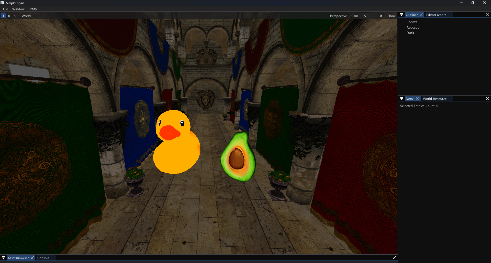

# SimpleEngine

게임엔진 공부 겸 그냥 하고 싶은 대로 만드는 프로젝트



## 구현된 시스템

- **ECS**: Bevy 스타일 쿼리, TMP 기반 파라미터 자동 주입, 컴파일 타임 With/Without 필터
- **Job System**: C++20 코루틴 기반 비동기 태스크, Work-Stealing Deque + MPSC Queue
- **Render Graph**: SDL3 GPU API 기반, RenderPass 추상화
- **Asset Pipeline**: Generational Handle, DDC(Derived Data Cache), 비동기 로딩
- **Editor**: Dear ImGui 기반 (SDL3 + SDL_GPU 백엔드)
- **VFS**: 가상 파일시스템
- **Reflection**: 매크로 기반 타입 리플렉션 (`SE_CLASS`, `SE_ANNOTATION`), Reflection 기반 자동 직렬화 지원
- **Math**: Vector, Matrix, AABB, Ray, SIMD (AVX2 / NEON)
- **Input**: 키보드/마우스 상태 관리, 프레임 기반 Pressed/Released/Down 쿼리
- **Logging**: 다중 백엔드 (Console, File)

핵심 구조는 OOP, 게임 로직은 ECS.

- 좌표계: right-hand, z-up
- 1 unit = 1 meter

## 빌드 환경

| 도구                        | 버전     | 비고                      |
|---------------------------|--------|-------------------------|
| CMake                     | 3.28+  |                         |
| vcpkg                     | 최신     | `VCPKG_ROOT` 환경변수 설정 필요 |
| Rust / rustup             | stable | ICU4X Corrosion 빌드에 필요  |
| MSVC (Visual Studio 2026) | 17.x+  |                         |
| Ninja (필수는 아님)            | 최신     | 단일 구성 생성기 사용 시 필요       |

## 빌드

> 자세한 내용은 [QuickStart](Docs/Codex/00_Meta/QuickStart.md) 참고

**요구사항**: CMake 3.28+, MSVC 17.x+, vcpkg (`VCPKG_ROOT` 설정), Rust stable, Ninja

```shell
# 클론
git clone --recurse-submodules https://github.com/gudtldn/SimpleEngine.git

# 이미 클론한 경우 서브모듈 초기화
git submodule update --init --recursive

# 빌드
cmake --preset debug-msvc
cmake --build --preset debug-msvc
```

## 문서

설계 결정, 아키텍처 설명 등은 [Docs/Codex](Docs/Codex/) 참고.

## 참고한 프로젝트 및 엔진

- [Wicked Engine](https://github.com/turanszkij/WickedEngine)
- [Unreal Engine](https://github.com/EpicGames/UnrealEngine)
- [Bevy Engine](https://github.com/bevyengine/bevy)
